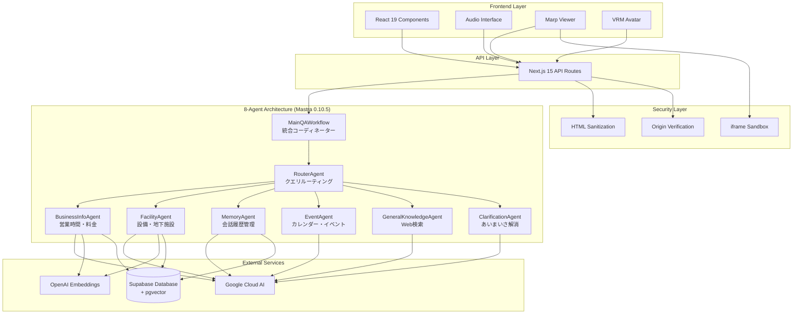

# Engineer Cafe Navigator ドキュメント

> 包括的なプロジェクトドキュメント集

## 📚 ドキュメント一覧

### 🏠 メインドキュメント
- **[README.md](../README.md)** - プロジェクト概要・セットアップガイド・基本的な使用方法
- **[README-EN.md](../README-EN.md)** - English version of project overview
- **[frontend/README.md](../frontend/README.md)** - Frontendアプリケーション詳細
- **[backend/README.md](../backend/README.md)** - Backendアプリケーション詳細

### 🚀 クイックスタート・セットアップ
- **[development/AGENT-QUICKSTART.md](development/AGENT-QUICKSTART.md)** - エージェント開発クイックスタートガイド（10分で開始）
- **[development/LOCAL-DEVELOPMENT-SETUP.md](development/LOCAL-DEVELOPMENT-SETUP.md)** - ローカル開発環境セットアップガイド（Docker/mise対応）
- **[development/ENVIRONMENT-VARIABLES.md](development/ENVIRONMENT-VARIABLES.md)** - 環境変数設定ガイド（完全版）

### 🛠️ 開発ガイド

#### 📖 開発者向けドキュメント
- **[development/DEVELOPER-GUIDE.md](development/DEVELOPER-GUIDE.md)** - 開発者向け包括的ガイド
- **[development/LANGGRAPH-DEVELOPMENT-GUIDE.md](development/LANGGRAPH-DEVELOPMENT-GUIDE.md)** - LangGraph開発ガイド
- **[development/AGENT-IMPLEMENTATION-REQUEST.md](development/AGENT-IMPLEMENTATION-REQUEST.md)** - 新規エージェント実装依頼テンプレート
- **[development/AGENT-IMPLEMENTATION-CHECKLIST.md](development/AGENT-IMPLEMENTATION-CHECKLIST.md)** - エージェント実装チェックリスト
- **[development/AGENT-EXAMPLES.md](development/AGENT-EXAMPLES.md)** - エージェント実装サンプル集

#### 🔧 プロジェクト管理・ワークフロー
- **[development/CLAUDE.md](development/CLAUDE.md)** - Claude Code向け開発ガイダンス
- **[development/AGENTS.md](development/AGENTS.md)** - エージェント体制概要
- **[development/AGILE-AI-DEVELOPMENT.md](development/AGILE-AI-DEVELOPMENT.md)** - アジャイルAI開発手法
- **[development/BRANCH-PROTECTION-SETUP.md](development/BRANCH-PROTECTION-SETUP.md)** - ブランチ保護設定ガイド
- **[development/CONTRIBUTING.md](development/CONTRIBUTING.md)** - コントリビューションガイド

#### 🧪 テスト・品質保証
- **[testing/TESTING-GUIDE.md](testing/TESTING-GUIDE.md)** - テストガイド
- **[development/CODE-REVIEW-GUIDELINES.md](development/CODE-REVIEW-GUIDELINES.md)** - コードレビューガイドライン
- **[development/IMPLEMENTATION-LIMITATIONS.md](development/IMPLEMENTATION-LIMITATIONS.md)** - 実装制限事項

#### 🆘 トラブルシューティング・メンテナンス
- **[development/TROUBLESHOOTING.md](development/TROUBLESHOOTING.md)** - トラブルシューティングガイド（包括版）
- **[development/MAINTENANCE-GUIDE.md](development/MAINTENANCE-GUIDE.md)** - メンテナンスガイド

### 📖 API仕様
- **[api/API.md](api/API.md)** - REST API 完全仕様書（英語）
- **[api/API-ja.md](api/API-ja.md)** - REST API 完全仕様書（日本語）
- **[api/api-setup-guide.md](api/api-setup-guide.md)** - API セットアップガイド

### 🏗️ アーキテクチャ
- **[architecture/SYSTEM-ARCHITECTURE.md](architecture/SYSTEM-ARCHITECTURE.md)** - システムアーキテクチャ詳細
- **[architecture/UNIFIED-ARCHITECTURE.md](architecture/UNIFIED-ARCHITECTURE.md)** - 統合アーキテクチャ概要

### 🔒 セキュリティ
- **[SECURITY.md](SECURITY.md)** - セキュリティ対策・脅威分析
  - XSS対策実装
  - iframe サンドボックス化
  - postMessage Origin検証
  - データ保護・プライバシー
  - インシデント対応手順
  - セキュリティ監査

### 🚀 デプロイメント
- **[DEPLOYMENT.md](DEPLOYMENT.md)** - 本番環境デプロイ手順
  - インフラストラクチャ構成
  - Vercel デプロイ
  - Supabase 設定
  - Google Cloud 設定
  - 監視・ログ設定
  - CI/CD パイプライン
  - トラブルシューティング

### 📚 技術資料・レポート
- **[MIGRATION-GUIDE.md](MIGRATION-GUIDE.md)** - マイグレーションガイド
- **[MIGRATION-COMPLETION-REPORT.md](MIGRATION-COMPLETION-REPORT.md)** - マイグレーション完了報告
- **[RAG-SYSTEM-COMPLETION-REPORT.md](RAG-SYSTEM-COMPLETION-REPORT.md)** - RAGシステム完了報告
- **[PRESENTATION-MODE-GUIDE.md](PRESENTATION-MODE-GUIDE.md)** - プレゼンテーションモードガイド
- **[STATUS.md](STATUS.md)** - プロジェクトステータス
- **[CHANGELOG.md](CHANGELOG.md)** - 変更履歴

### 📂 データ・コンテンツ
- **[development/data-input-guide.md](development/data-input-guide.md)** - データ入力ガイド
- **[development/memory-rag-integration.md](development/memory-rag-integration.md)** - メモリ・RAG統合
- **[development/stt-correction-coverage.md](development/stt-correction-coverage.md)** - STT補正カバレッジ
- **[development/repo-structure.md](development/repo-structure.md)** - リポジトリ構造

### 📝 ブログ記事
- **[blog/2025-06-29_AIアシスタントが空気を読めるようになった話〜会話の文脈を理解してピンポイントで答える技術〜.md](blog/2025-06-29_AIアシスタントが空気を読めるようになった話〜会話の文脈を理解してピンポイントで答える技術〜.md)**

### 🗃️ アーカイブドキュメント
- **[archive/README.md](archive/README.md)** - アーカイブドキュメント一覧
- 過去のレポート、古いバージョンのドキュメント等

### 🔄 マイグレーション関連
- **[migration/agents/](migration/agents/)** - エージェント移行関連ドキュメント
  - 各エージェントの実装ガイド・仕様・テスト
  - OpenRouter統合ベストプラクティス

## 🎯 ドキュメント使用ガイド

### 新規エンジニア向け（推奨読書順序）

1. **[README.md](../README.md)** - プロジェクト概要を理解（5分）
2. **[development/AGENT-QUICKSTART.md](development/AGENT-QUICKSTART.md)** - 10分で開発開始（クイックスタート）
3. **[development/LOCAL-DEVELOPMENT-SETUP.md](development/LOCAL-DEVELOPMENT-SETUP.md)** - ローカル環境構築（15分）
4. **[development/ENVIRONMENT-VARIABLES.md](development/ENVIRONMENT-VARIABLES.md)** - 環境変数設定（10分）
5. **[development/DEVELOPER-GUIDE.md](development/DEVELOPER-GUIDE.md)** - 開発ガイド詳細（30分）
6. **[architecture/SYSTEM-ARCHITECTURE.md](architecture/SYSTEM-ARCHITECTURE.md)** - アーキテクチャ理解（20分）
7. **[api/API.md](api/API.md)** - API仕様確認（必要に応じて）

### エージェント開発者向け

1. **[development/AGENT-QUICKSTART.md](development/AGENT-QUICKSTART.md)** - クイックスタート
2. **[development/AGENT-IMPLEMENTATION-CHECKLIST.md](development/AGENT-IMPLEMENTATION-CHECKLIST.md)** - 実装チェックリスト
3. **[development/AGENT-EXAMPLES.md](development/AGENT-EXAMPLES.md)** - 実装サンプル
4. **[development/AGENT-IMPLEMENTATION-REQUEST.md](development/AGENT-IMPLEMENTATION-REQUEST.md)** - 新規エージェント依頼テンプレート
5. **[development/LANGGRAPH-DEVELOPMENT-GUIDE.md](development/LANGGRAPH-DEVELOPMENT-GUIDE.md)** - LangGraph詳細

### 本番デプロイ担当者向け

1. **[DEPLOYMENT.md](DEPLOYMENT.md)** - デプロイ手順を実行
2. **[SECURITY.md](SECURITY.md)** - セキュリティ設定を確認
3. **[api/API.md](api/API.md)** - エンドポイント動作を検証
4. **[development/TROUBLESHOOTING.md](development/TROUBLESHOOTING.md)** - トラブル対応

### トラブルシューティング時

1. **[development/TROUBLESHOOTING.md](development/TROUBLESHOOTING.md)** - 包括的トラブルシューティングガイド
2. **[development/MAINTENANCE-GUIDE.md](development/MAINTENANCE-GUIDE.md)** - メンテナンスガイド
3. **[testing/TESTING-GUIDE.md](testing/TESTING-GUIDE.md)** - テストガイド

### コードレビュー担当者向け

1. **[development/CODE-REVIEW-GUIDELINES.md](development/CODE-REVIEW-GUIDELINES.md)** - コードレビューガイドライン
2. **[development/CONTRIBUTING.md](development/CONTRIBUTING.md)** - コントリビューションガイド
3. **[SECURITY.md](SECURITY.md)** - セキュリティ要件

## 📋 実装状況サマリー

### ✅ 完了済み機能

| カテゴリ | 機能 | 実装状況 | ドキュメント |
|----------|------|----------|-------------|
| **音声処理** | 音声認識・合成 | ✅ 完了 | [API.md](API.md#音声処理-api) |
| **スライド制御** | Marpスライド表示・操作 | ✅ 完了 | [API.md](API.md#スライド-api) |
| **キャラクター** | VRM 3Dキャラクター | ✅ 完了 | [API.md](API.md#キャラクター制御-api) |
| **多言語対応** | 日本語・英語切り替え | ✅ 完了 | [README.md](../README.md#主要機能) |
| **背景制御** | 動的背景変更 | ✅ 完了 | [README.md](../README.md#背景画像の配置) |
| **セキュリティ** | XSS対策・Origin検証 | ✅ 完了 | [SECURITY.md](SECURITY.md#実装済みセキュリティ対策) |
| **8エージェント体制** | マルチエージェントアーキテクチャ | ✅ 完了 | [README.md](../README.md#8エージェント体制への完全移行) |
| **あいまいさ解消** | カフェ・会議室の明確化 | ✅ 完了 | [README.md](../README.md#あいまいさ解消機能) |
| **会話記憶** | 3分間の短期記憶 | ✅ 完了 | [memory-rag-integration.md](memory-rag-integration.md) |
| **Enhanced RAG** | エンティティ認識・優先度スコアリング | ✅ 完了 | [RAG-SYSTEM-COMPLETION-REPORT.md](RAG-SYSTEM-COMPLETION-REPORT.md) |

### 🔄 実装予定機能

| 機能 | 優先度 | 予定時期 | 関連ドキュメント |
|------|--------|----------|-----------------|
| レート制限 | 高 | Q1 2024 | [SECURITY.md](SECURITY.md#api-セキュリティ) |
| 外部システム連携 | 中 | Q2 2024 | [API.md](API.md#外部連携-api) |
| 高度なAI対話 | 中 | Q2 2024 | [README.md](../README.md#ロードマップ) |
| モバイル対応 | 低 | Q3 2024 | [README.md](../README.md#ロードマップ) |

## 🏗️ アーキテクチャ概要



## 🔐 セキュリティハイライト

### 実装済み対策

- **XSS防止**: HTMLサニタイゼーション + CSP
- **iframe 保護**: サンドボックス化 + Origin検証
- **通信暗号化**: HTTPS + セキュリティヘッダー
- **入力検証**: Zod スキーマバリデーション
- **状態管理**: UI状態同期によるプライバシー保護

詳細: **[SECURITY.md](SECURITY.md)**

## 📊 パフォーマンス目標

| メトリクス | 目標値 | 現在値 | 測定方法 |
|-----------|--------|--------|----------|
| 初期ロード時間 | < 2秒 | ~1.5秒 | Lighthouse |
| API応答時間 | < 800ms | ~600ms | 内部監視 |
| 音声認識開始 | < 200ms | ~150ms | Performance API |
| スライド切り替え | < 100ms | ~80ms | デバッグパネル |

## 🛠️ 開発ツール・設定

### 必要なツール
- **Node.js**: 18.0.0+
- **pnpm**: 8.0.0+
- **Git**: 最新版
- **VSCode**: 推奨エディタ

### 推奨拡張機能
- Tailwind CSS IntelliSense
- TypeScript Next.js
- Prettier
- ESLint

詳細: **[DEVELOPMENT.md](DEVELOPMENT.md#開発環境セットアップ)**

## 🚀 クイックスタート

```bash
# 1. リポジトリクローン
git clone https://github.com/your-org/engineer-cafe-navigator.git
cd engineer-cafe-navigator

# 2. 依存関係インストール
pnpm install

# 3. 環境変数設定
cp .env.example .env.local
# .env.localを編集

# 4. 開発サーバー起動
pnpm run dev
```

詳細手順: **[README.md](../README.md#クイックスタート)**

## 📞 サポート・コントリビューション

### 技術サポート
- **Issues**: [GitHub Issues](https://github.com/your-org/engineer-cafe-navigator/issues)
- **Discussions**: [GitHub Discussions](https://github.com/your-org/engineer-cafe-navigator/discussions)
- **Email**: tech-support@engineer-cafe.jp

### コントリビューション
1. フォーク → ブランチ作成 → 変更 → プルリクエスト
2. **[DEVELOPMENT.md](DEVELOPMENT.md#コード品質・規約)** のコーディング規約に従う
3. テスト追加・セキュリティ考慮必須

### ドキュメント改善
ドキュメントの改善提案や誤字脱字の報告も歓迎します！

## 📝 更新履歴

### v1.3.0 (2025-07-03)
- ✅ 8エージェント体制への完全移行
- ✅ ClarificationAgent実装（あいまいさ解消機能）
- ✅ メモリベースのフォローアップ対応
- ✅ レガシーコード削除（EnhancedQAAgent 2,342行）
- ✅ ドキュメント全面更新

### v1.2.0 (2024-01-30)
- ✅ セキュリティ強化（XSS対策、Origin検証）
- ✅ 背景制御機能追加
- ✅ UI状態同期改善
- ✅ ドキュメント全面更新

### v1.1.0 (2024-01-25)
- ✅ Marpスライドビューア改善
- ✅ キャラクター表情制御
- ✅ 多言語対応強化

### v1.0.0 (2024-01-20)
- ✅ 初期リリース
- ✅ 基本機能実装完了

---

<div align="center">

**📚 Comprehensive Documentation - Engineer Cafe Navigator**

[🏠 メインページ](../README.md) • [🔧 開発ガイド](DEVELOPMENT.md) • [🚀 デプロイガイド](DEPLOYMENT.md) • [🔒 セキュリティ](SECURITY.md)

---

**Built with ❤️ by Engineer Cafe Team**

</div>