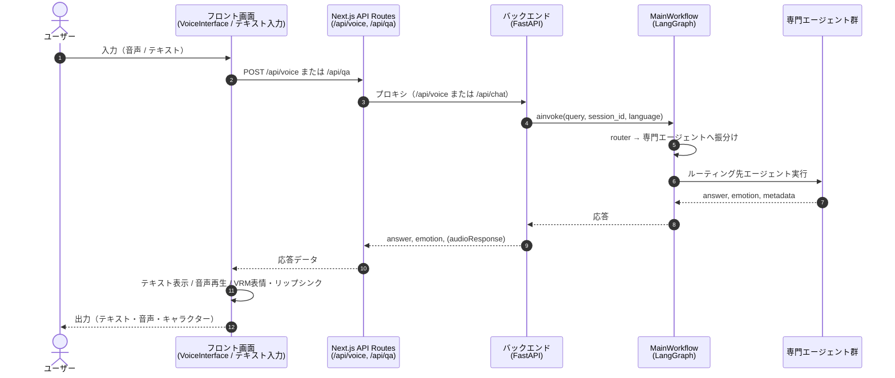
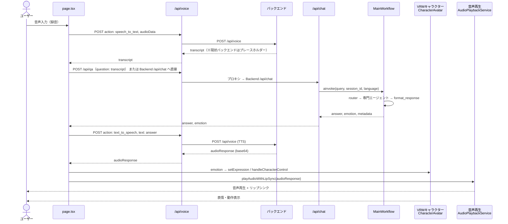
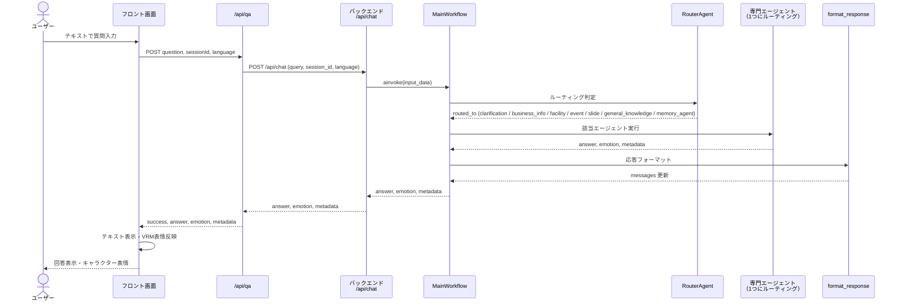
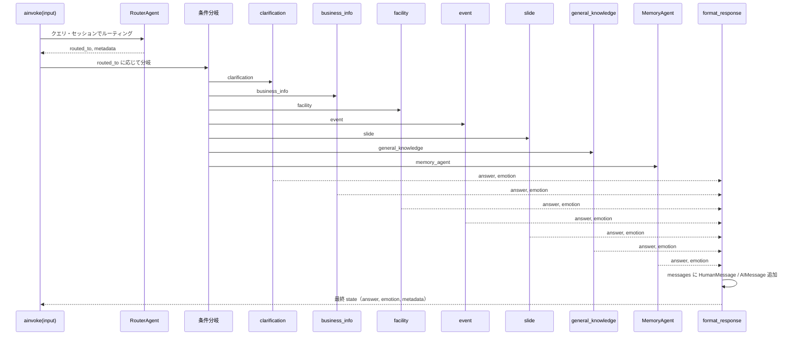
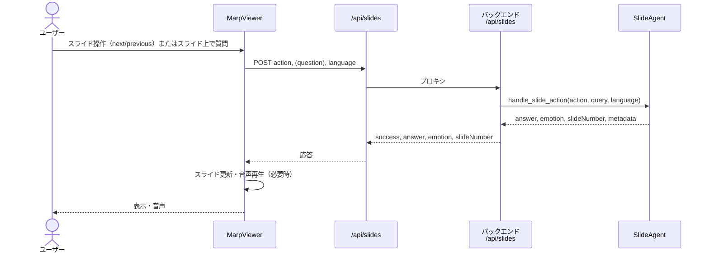

# システムシーケンス図

> 注意: この文書には RouterAgent / MemoryAgent 前提の旧シーケンスが含まれます。現行の request path 判断には `docs/STATUS.md` と実装コードを優先してください。

> フロント画面の入力〜バックエンド処理〜フロント画面への出力までを、現在想定している流れで Mermaid シーケンス図として記述する。
> このドキュメントは、今後の設計に応じて更新していく。

---

## 1. 全体フロー概要（音声・テキスト入力 → 応答出力）

---

## 2. 音声入力フロー（詳細）

音声のみの経路：STT → QA（チャット）→ TTS → キャラクター制御。

※ 現状、バックエンドの `/api/voice` はプレースホルダー実装のため、STT/TTS はフロントまたは別サービス連携を想定した流れです。

---

## 3. テキスト入力フロー（Q&A）

テキストのみの経路：質問 → /api/qa → /api/chat → MainWorkflow → 応答 → 表示・キャラクター。

RouterAgent がバックエンドの窓口となり、MemoryAgent を含む専門エージェントへ振り分ける。MemoryAgent は直近の会話履歴の参照や、FAQ のように同種の問答があれば他専門エージェントを介さず回答を生成する役割を持つ。

---

## 4. バックエンド MainWorkflow（LangGraph）内部

RouterAgent が窓口となり、MemoryAgent を含む専門エージェントへ振り分ける流れ。MemoryAgent は直近会話履歴の参照や、同種問答（FAQ 的）の場合は他エージェントを介さず回答を生成する。

※ 実装では、Router の前に会話コンテキスト取得用の memory ノードを実行している場合がある。設計上の窓口は RouterAgent であり、MemoryAgent は専門エージェントの一つとして振り分け先となる。

---

## 5. スライド操作フロー（参考）

スライド表示・ナレーション・スライド上での質問は、MainWorkflow を経由せずバックエンドの SlideAgent を直接呼ぶ経路もある。

---

## 6. 入力・出力の対応まとめ

| 種別 | 入力 | 主なAPI | バックエンド処理 | 出力 |
|------|------|---------|------------------|------|
| **音声** | マイク録音（base64） | POST /api/voice (speech_to_text, text_to_speech) | QA 部分は /api/chat → MainWorkflow | テキスト表示・音声再生・VRMリップシンク・表情 |
| **テキスト** | テキスト質問 | POST /api/qa → Backend /api/chat | MainWorkflow (router → 専門エージェント → format_response) | テキスト表示・VRM表情 |
| **画像** | 現状なし | — | — | 背景画像・スライド用画像は設定パネル/静的配置のみ。Q&A の画像入力は想定外 |
| **スライド** | 操作・スライド内質問 | POST /api/slides | SlideAgent 直接 | スライド表示・ナレーション音声・回答表示 |

---

## 7. 既存ドキュメント

- [frontend/README.md](../../frontend/README.md): Mermaid の アーキテクチャ構成図（graph TB）あり
- [backend/README.md](../../backend/README.md)
- [SYSTEM-ARCHITECTURE.md](SYSTEM-ARCHITECTURE.md): データフローのテキスト説明あり
- **本ドキュメント**: 上記を補う形で、想定しているシーケンスを Mermaid で初めてまとめたもの。

更新時は上記ドキュメントとの整合性を取ること
