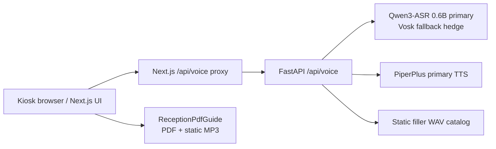

# STT / TTS Stack and Slide Audio Decision

作成日: 2026-05-09

## Status

Accepted for the post-alpha baseline.

This document closes the old OSS-release and slide-audio planning loop for
#484, #492, #493, #494, #495, and #496. Future changes should be opened as
new, concrete runtime or asset-management issues rather than reopening the
old exploratory tickets.

## Current Runtime Stack

Production deploy sets `STT_PROVIDER=qwen-primary`, `TTS_PROVIDER=piper`, and
`TTS_REQUIRE_PRIMARY_PROVIDER=true`. The STT path keeps Qwen-first accuracy and
uses Vosk only as a fallback / hedged path. The STT latency work continues in
#529; this document does not claim the `<1.5s` target is met.

## Slide Narration

The alpha slide path no longer depends on Marp playback. The runtime path is:

- PDF assets:
  - `frontend/public/reception/engineer-cafe-ja.pdf`
  - `frontend/public/reception/engineer-cafe-en.pdf`
- Static narration audio:
  - `frontend/public/reception/audio/ja/01.mp3` through `05.mp3`
  - `frontend/public/reception/audio/en/01.mp3` through `05.mp3`
- Runtime component:
  - `frontend/src/app/components/ReceptionPdfGuide.tsx`
- Contract tests:
  - `frontend/src/__tests__/reception-narration-assets.test.ts`
  - `frontend/e2e/reception-pdf-guide.spec.ts`
  - `frontend/e2e/slide-pdf-narration.spec.ts`

The old D-series plan described CI-generated WAV/MP3 plus CDN versioning. For
alpha, the simpler accepted architecture is checked-in PDF/MP3 assets under
`frontend/public/reception`, served by the frontend host as immutable build
assets. If the slide deck changes, regenerate the MP3 set in the same PR as the
PDF/Markdown narration update and keep the page count tests green.

## TTS Decision

PiperPlus is the current production TTS stack. It is used for normal answer
speech, generated slide narration, and filler assets. Browser Web Speech
fallback is not part of the production audio path; if PiperPlus cannot produce
audio, the turn should fail visibly rather than switching to a different voice.

Kokoro-82M remains a valid future research candidate, but it is not part of the
alpha production stack. The Kokoro A/B issue is therefore closed as
de-scoped, not failed. Reopen a new issue only if the production goal changes
from "PiperPlus unified voice" to "compare TTS providers again".

## License Summary

| Component | Current role | License / terms | Repository artifact |
| --- | --- | --- | --- |
| Qwen3-ASR 0.6B | STT primary | Apache-2.0 | model downloaded by backend build |
| Vosk small JA/EN | STT fallback | Apache-2.0 | model downloaded by backend build |
| PiperPlus | TTS primary and generated audio source | MIT for engine/fork; generated voice output follows source voice terms | `docker/piper-plus`, generated MP3/WAV assets |
| pdf.js (`pdfjs-dist`) | Reception PDF rendering | Apache-2.0 | frontend dependency |
| Marp packages | Legacy / tooling only | MIT | not the alpha runtime slide path |

The authoritative dependency and model inventory is
`THIRD_PARTY_LICENSES.md`. This document is the architecture decision layer,
not a legal opinion.

## Operational Follow-up

- #529 remains open for STT first-hop latency and runtime spike decisions.
- #774 remains open for onsite hardening, including real M5Stack proof, DB/cron
  load, and TTS provider fault recovery.
- Any future slide-audio issue should be tied to a concrete defect such as a
  missing MP3, wrong language, page-count mismatch, or frontend playback bug.
