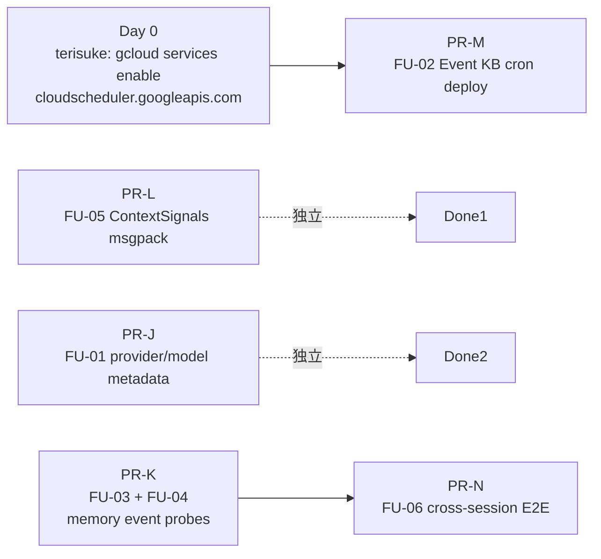

# 🚦 Phase 2 Readiness Handoff: PR #841 後の残課題まとめ

> **対象**: 現在実装を担当しているエンジニア
> **作成**: 2026-05-17, Claude Code session (terisuke 指示)
> **位置付け**: PR #841 (post-#834 critical followups) マージ後、Phase 2 (Semantic Router 三段カスケード / hierarchical Store namespace / dynamic filler 等の根本改善) 着手前に潰しておくべき残バグの確定ハンドオフ
> **方針**: PR #841 では 16 FIX 中 15 件が解決済み、本 doc では **「観測性レイヤーが嘘をついていない」状態に持っていく** のが主目的
> **証跡**: GCP Cloud Logging rev `engineer-cafe-backend-00209-b9v` 以降 + 静的 grep + Cloud Run env 実測 + ライブ API テスト

---

## 0. Executive Summary

| 区分 | 件数 | 想定総工数 |
|---|---|---|
| 🔴 **P0** (Phase 2 開始前に必修) | **4** | 半日〜2日 |
| 🟠 **P1** (Phase 2 開始前に望ましい) | **2** | 1〜2日 |
| 🟡 **P2** (Phase 2 と並行可能) | 5 | Issue #770 frontend 5 項目 |
| 🟢 **Phase 2 scope (本ハンドオフ対象外)** | 6 | dynamic filler / cross-encoder rerank / D-RAG 等 |

### 6 件の即修正項目（重要度順）

| ID | 重要度 | タイトル | 想定工数 | ADR Phase / 関連 |
|---|---|---|---|---|
| **FU-01** | 🔴 P0 | `chat_response.provider/model/llm_latency_ms` が常に `unknown` (FIX-04 半壊) | 2〜3 時間 | ADR-024 A0 完了条件達成 |
| **FU-02** | 🔴 P0 | Event KB Cron Sync 未デプロイ (script はある、Cloud Scheduler API 自体が未有効化) | 半日 | Issue #517 解消 |
| **FU-03** | 🔴 P0 | Phase A1 SLO probe `memory_loader_get_recent_messages_duration_ms` 未配線 | 2 時間 | ADR-024 A1 完了条件達成 |
| **FU-04** | 🔴 P0 | `memory_*` event family が 3 種類 (ADR-024 A0 目標 ≥ 5) | 半日 | ADR-024 A0 完了条件達成 |
| **FU-05** | 🟠 P0 | `ContextSignals` msgpack 未登録 (LangGraph 将来 version でブロック予定) | 1 時間 | LangGraph 互換性 |
| **FU-06** | 🟠 P1 | cross-session recall (Issue #655 M-LTM-001) E2E proof 未取得 | 1 日 | Issue #655 解消 |

### 推奨 PR 分割（5 PRs + 1 非コード作業）

```
PR-J: FU-01                              (provider/model metadata 直接伝達, 2〜3h)
PR-K: FU-03 + FU-04                      (memory event probes 完成, 半日)
PR-L: FU-05                              (ContextSignals msgpack 登録, 1h)
PR-M: FU-02                              (Event KB cron deploy, 半日)
PR-N: FU-06                              (cross-session recall E2E, 1日)

非コード作業: Cloud Scheduler API 有効化 (terisuke 直接、5 分)
```

**直列依存**: PR-K (FU-04 で memory event family 拡充) と PR-N (FU-06 で cross-session E2E) は前者が後者の検証 probe を提供するので **PR-K → PR-N の順** を推奨。

**並列可能**: PR-J / PR-L / PR-M は互いに独立。

---

## 1. 共通ルール

### 1.1 ブランチ・PR (CLAUDE.md / ADR-023 規約と同じ)
- 命名: `fix/phase2-readiness-{FU-ID}-{slug}` (例: `fix/phase2-readiness-fu01-provider-metadata`)
- 全 PR `--base develop`
- 1 PR = 1 FU (または密接に依存する複数 FU)
- PR body 必須項目:
  - 対応 FU-ID
  - 本ハンドオフへのリンク
  - 検証エビデンス (CI green + gcloud / pytest 実行ログ)
  - `Refs #<Epic 番号>` (最後の PR で `Closes #<Epic 番号>`)
  - `Co-Authored-By:` 行

### 1.2 CI gate
```bash
cd backend && ruff check . && black --check . && pytest -m "not ragas and not slow"
cd frontend && pnpm lint --quiet  # mise 環境を揃えること
```

### 1.3 レビュー必須
- code-reviewer agent
- Codex CLI 経路A (`codex exec review`)
- 両 LGTM 後にマージ

---

## 2. 🔴 P0 — Phase 2 開始前に必修

### 🔴 FU-01: `chat_response.provider/model/llm_latency_ms` が常に `unknown`

**何が壊れているか**: FIX-04 (PR #841) で schema は実装したが、live data では Cerebras が呼ばれているのに `provider=unknown / model=unknown / llm_latency_ms=null` が返る。観測性ゼロのまま。

**Evidence** (2026-05-17 ライブテスト 2 件):
```bash
# Test 1
curl -X POST .../api/chat -d '{"query":"今週のイベントについて..."}'
# Server logs:
#   2026-05-17T00:58:39.198 INFO Trying Cerebras fast primary model=gpt-oss-120b
#   2026-05-17T00:58:40.018 WARNING No cost data for model 'gpt-oss-120b' ← Cerebras response received
# chat_response:
#   request_id=verify-fix04-llm-real-1778979515
#   route=unknown, provider=unknown, model=unknown, llm_latency_ms=null, agent_class=EventAgent
```

**Root cause** (本セッションでコード追跡):
- `openrouter.py:262` `_record_successful_llm_call(provider="cerebras", model=..., started_at=...)` → `record_llm_call_metadata` → `_token_tracker_var.get().record_llm_call(...)` で `_llm_calls` に append
- `main.py:871` `_attach_latest_llm_metadata(metadata)` → `_token_tracker_var.get().latest_llm_call` を読む
- ⚠️ Starlette `BaseHTTPMiddleware` の既知問題で `ContextVar` の child task 書き込みが parent task に伝播しない (参考: encode/starlette#420)
- LangGraph のサブグラフ実行が `asyncio.create_task` 経由で context fork すると `_llm_calls.append` が main 側から見えない

**Fix steps**:

**選択肢A (推奨, ContextVar 経由をやめる)**:

agent ノード内で metadata に直接 inject。`_attach_latest_llm_metadata` を deprecate。

[`backend/llm/openrouter.py`](../../backend/llm/openrouter.py) `generate()` の戻り値を `tuple[str, dict]` 化:
```python
async def generate(...) -> tuple[str, dict]:
    # ... Cerebras success path:
    started_at = time.perf_counter()
    response_text = await self._cerebras_generate(messages, root_cfg)
    llm_meta = {
        "provider": "cerebras",
        "model": cerebras_model_slug(),
        "llm_latency_ms": int((time.perf_counter() - started_at) * 1000),
    }
    return response_text, llm_meta
```

各 agent (`event_agent.py`, `facility_agent.py`, `business_info_agent.py`, `general_knowledge_agent.py`, `farewell_agent.py`, `slide_agent.py`) で:
```python
response_text, llm_meta = await self.llm_provider.generate(...)
return {
    "answer": response_text,
    "metadata": {**meta, **llm_meta},  # provider/model/llm_latency_ms を直接含める
}
```

`main.py:871` `_attach_latest_llm_metadata(metadata)` は呼び出し不要に。あるいは setdefault で既存 metadata の値を優先するように。

**選択肢B (ContextVar を残す, パッチ)**:

`token_tracker._llm_calls` を **dict (request_id keyed)** にしてグローバル singleton にすることで ContextVar 依存をなくす。middleware で request_id を ContextVar に入れる方式。

→ 選択肢A の方が破壊範囲は大きいが設計的に clean。LangGraph 状態経由で確実に伝達できる。

**Verification**:
```bash
# 同じ live curl テストを実行:
curl -X POST .../api/chat -H "X-API-Key: $KEY" \
  -d '{"query":"今週のイベントを紹介してください", "session_id":"verify-fu01", "language":"ja"}'

gcloud logging read 'resource.type="cloud_run_revision" AND ... AND jsonPayload.event="chat_response" AND timestamp >= "<deploy 時刻>"' \
  --project=aipartner-426616 --format="value(jsonPayload.provider,jsonPayload.model,jsonPayload.llm_latency_ms,jsonPayload.route)" --limit=5
# → "cerebras gpt-oss-120b <数百ms> events" が出れば PASS
# → unknown / null が消えれば PASS
```

**Effort**: 2〜3 時間 (実装 + 全 agent 改修 + tests)
**Dependencies**: 無し
**Blocks**: ADR-024 A0 完了条件達成、Phase 2 で critic_node の信頼性

**重要度**: 🔴 **P0**

---

### 🔴 FU-02: Event KB Cron Sync 未デプロイ (Issue #517)

**何が壊れているか**: `backend/scripts/sync_event_kb.py` は実装済だが、**Cloud Scheduler API 自体が GCP プロジェクトで未有効化** + cron ジョブ未デプロイ。EventAgent は静的 `events.yaml` だけ参照、live ICS 同期されない。

**Evidence**:
```bash
$ gcloud scheduler jobs list --project=aipartner-426616 --location=asia-northeast1
ERROR: Cloud Scheduler API has not been used in project aipartner-426616 before
       or it is disabled.

$ ls backend/scripts/sync_event_kb.py
-rw-r--r--  ... backend/scripts/sync_event_kb.py  ← script は存在
```

**Impact**: イベント情報が日程変更されても backend KB に反映されず、EventAgent が古いデータで回答。Issue #517 / Issue #509 系の根本原因。

**Fix steps**:

1. Cloud Scheduler API を有効化 (terisuke / GCP admin 直接実行):
```bash
gcloud services enable cloudscheduler.googleapis.com --project=aipartner-426616
```

2. `sync_event_kb.py` を Cloud Run Job として deploy:
```bash
gcloud run jobs create event-kb-sync \
  --image=asia-northeast1-docker.pkg.dev/aipartner-426616/cloud-run-source-deploy/engineer-cafe-backend:latest \
  --region=asia-northeast1 \
  --command=python \
  --args="-m,backend.scripts.sync_event_kb,--ics-url,${GOOGLE_CALENDAR_ICAL_URL}" \
  --set-secrets="SUPABASE_URL=SUPABASE_URL:latest,SUPABASE_KEY=SUPABASE_KEY:latest,GOOGLE_CALENDAR_ICAL_URL=GOOGLE_CALENDAR_ICAL_URL:latest"
```

3. Cloud Scheduler ジョブ作成 (1日1回 09:00 JST):
```bash
gcloud scheduler jobs create http event-kb-sync-daily \
  --location=asia-northeast1 \
  --schedule="0 0 * * *" \
  --uri="https://${REGION}-run.googleapis.com/apis/run.googleapis.com/v1/namespaces/${PROJECT}/jobs/event-kb-sync:run" \
  --http-method=POST \
  --oauth-service-account-email=engineer-cafe-navigator@aipartner-426616.iam.gserviceaccount.com
```

4. `terraform/` 配下にこの設定を IaC 化 (将来の再現性確保)

**Verification**:
```bash
# Cloud Scheduler ジョブ確認
gcloud scheduler jobs list --location=asia-northeast1 --project=aipartner-426616
# → event-kb-sync-daily が表示されれば PASS

# 手動実行:
gcloud scheduler jobs run event-kb-sync-daily --location=asia-northeast1 --project=aipartner-426616

# Supabase knowledge_base テーブルで category='events' の最新 last_updated を確認
# → 当日の timestamp が記録されていれば PASS
```

**Effort**: 半日 (Scheduler 設定 + Cloud Run job 化 + Terraform + verification)
**Dependencies**: 無し
**Blocks**: Issue #517 解消、EventAgent の回答精度

**重要度**: 🔴 **P0**

---

### 🔴 FU-03: Phase A1 SLO probe 未配線

**何が壊れているか**: ADR-024 Phase A1 完了条件 「memory loader p95 ≤ 100ms」を観測するための `memory_loader_get_recent_messages_duration_ms` event family が **17日間 + rev 00209 で 0 件 emit**。FIX-06 の効果 (GIN index + SQL filter) を定量検証できない。

**Evidence**:
```bash
gcloud logging read 'resource.type="cloud_run_revision" AND ... AND jsonPayload.event="memory_loader_get_recent_messages_duration_ms"' --limit=5
# → 0 件
```

**Impact**: Phase A1 (FIX-06) が「完了」と判定不能。Phase A2 (hierarchical namespace) 進行時の性能リグレッション検知不可。

**Fix steps**:

[`backend/utils/memory_helper.py`](../../backend/utils/memory_helper.py) の `_get_recent_messages` 前後で計測:
```python
import time

async def _get_recent_messages(self, session_id: str) -> list[dict]:
    started_at = time.perf_counter()
    try:
        # ... 既存ロジック (SQL filter で取得)
        result = ...
        return result
    finally:
        duration_ms = int((time.perf_counter() - started_at) * 1000)
        log_memory_event(
            event="loader_get_recent_messages",
            session_id=session_id,
            duration_ms=duration_ms,
            row_count=len(result) if 'result' in locals() else 0,
        )
```

同様の計測を `get_previous_request_type`, `cleanup_session` 等にも追加 (event 名は `event="loader_get_previous_request_type_duration_ms"` 等)。

ベンチマーク script を別途追加: `backend/scripts/bench_memory_loader.py` で 1000 row 投入 → p95 計測。

**Verification**:
```bash
# 数 turn 投げた後:
gcloud logging read 'resource.type="cloud_run_revision" AND ... AND jsonPayload.event:"memory_loader_"' --limit=20 | sort -u
# → memory_loader_get_recent_messages が出ていれば PASS

# 1000 row benchmark:
python -m backend.scripts.bench_memory_loader --session-id=bench-1 --message-count=1000
# → p95 ≤ 100ms が PASS
```

**Effort**: 2 時間 (計測追加 + benchmark script)
**Dependencies**: 無し (FU-04 と同 PR で出すと structured_logger 一括変更で効率的)
**Blocks**: ADR-024 Phase A1 完了判定、Phase A2 着手前の baseline

**重要度**: 🔴 **P0**

---

### 🔴 FU-04: `memory_*` event family 3 種類 (ADR-024 A0 目標 ≥ 5)

**何が壊れているか**: ADR-024 A0 完了条件「`memory_*` event 5 種類以上 emit」に対し、実観測 **3 種類のみ**:
- `memory_context_load` ✅
- `memory_recent_messages_load` ✅
- `memory_store_message` ✅
- `memory_promote` ❌ 未配線
- `memory_extractor_*` ❌ 未配線
- `memory_candidate_aggregate` ❌ 未配線

**Impact**:
- LTM 昇格が live で起こっているか観測不能 (Issue #655 cross-session recall の根本原因)
- memory extractor の動作が見えない (どのターンで「太郎」を抽出したか不明)
- memory candidate の集約状況も見えない

**Fix steps**:

1. [`backend/services/memory_promoter.py`](../../backend/services/memory_promoter.py) `promote_for_user` 末尾:
```python
log_memory_event(
    event="promote_run",
    user_id=user_id,
    promoted_count=promotion_stats.get("promoted", 0),
    candidates_count=promotion_stats.get("candidates", 0),
    skipped_count=promotion_stats.get("skipped", 0),
)
```

2. [`backend/utils/memory_extractor.py`](../../backend/utils/memory_extractor.py) `extract_memories` / `extract_memory_candidates` 戻り値で:
```python
log_memory_event(
    event="extractor_run",
    extractor_type="visitor_name",  # or "episode_incident" etc.
    extracted_count=len(facts),
    language=language,
)
```

3. memory candidate aggregation: [`backend/services/memory_promoter.py`](../../backend/services/memory_promoter.py) `aggregate_candidates` で:
```python
log_memory_event(
    event="candidate_aggregate",
    user_id=user_id,
    aggregated_count=len(aggregated),
    raw_count=len(items),
)
```

**Verification**:
```bash
# 名前明示テスト発話を投げた後:
gcloud logging read 'resource.type="cloud_run_revision" AND ... AND jsonPayload.event:"memory_"' --limit=50 | sort -u
# → 5 種類以上の memory_* event が出れば PASS
```

**Effort**: 半日 (3 箇所追加 + tests)
**Dependencies**: 無し (FU-03 と同 PR にバンドル推奨)
**Blocks**: ADR-024 A0 完了判定、FU-06 cross-session recall verification の前提

**重要度**: 🔴 **P0**

---

### 🔴 FU-05: `ContextSignals` msgpack 未登録 (LangGraph 互換性)

**何が壊れているか**: rev 00209 で 2 件 WARNING:
```
WARNING langgraph.checkpoint.serde.jsonplus
Deserializing unregistered type backend.utils.context_priority.ContextSignals from checkpoint.
This will be blocked in a future version.
Set LANGGRAPH_STRICT_MSGPACK=true to block now, or add to allowed_msgpack_modules
to allow explicitly: [('backend.utils.context_priority', 'ContextSignals')]
```

**Impact**: 将来 LangGraph version up で deploy が壊れる時限爆弾。Phase 2 で LangGraph 0.5+ にアップグレード時に確実に詰む。

**Fix steps**:

**選択肢A (推奨)**: `ContextSignals` を `allowed_msgpack_modules` に登録。

[`backend/utils/checkpointer.py`](../../backend/utils/checkpointer.py) または StateGraph compile 時:
```python
from langgraph.checkpoint.postgres.aio import AsyncPostgresSaver
from langgraph.checkpoint.serde.jsonplus import JsonPlusSerializer

serde = JsonPlusSerializer(
    allowed_msgpack_modules=[
        ("backend.utils.context_priority", "ContextSignals"),
    ],
)
saver = AsyncPostgresSaver(conn, serde=serde)
```

**選択肢B**: `ContextSignals` を dataclass → `TypedDict` に refactor (msgpack 自動対応)。

**Verification**:
```bash
# デプロイ後 5 分:
gcloud logging read 'resource.type="cloud_run_revision" AND ... AND jsonPayload.message:"ContextSignals"' --limit=5
# → 0 件が PASS
```

**Effort**: 1 時間 (登録 + tests)
**Dependencies**: 無し
**Blocks**: 将来の LangGraph version up

**重要度**: 🔴 **P0** (時限爆弾)

---

## 3. 🟠 P1 — Phase 2 開始前に望ましい

### 🟠 FU-06: cross-session recall (Issue #655 M-LTM-001) E2E proof 未取得

**何が壊れているか**: Issue #655 M-LTM-001 「跨セッション (visitor 2 人目以降が 1 人目の preference を recall すべき) で memory が引けていない」が、PR #841 後も検証されていない。

- `ENABLE_MEMORY_PROMOTION=true` 設定済
- `ENABLE_MEMORY_CANDIDATES=true` 設定済
- だが rev 00209 で「Promoted memories」ログ **0 件** (流量少のため真偽不明)

**Impact**: Issue #655 が open のまま Phase 2 に進むと、memory architecture の問題が Semantic Router cascade と複合してデバッグ困難に。

**Fix steps**:

1. E2E テスト追加: `backend/tests/e2e/test_cross_session_recall.py`
```python
async def test_cross_session_name_recall():
    # Session 1: 名前明示
    response1 = await chat(session_id="cross-1-A", query="私の名前は太郎です。明日また来ます")
    
    # FU-04 で追加した memory_promote event 確認
    assert promote_event_emitted(session_id="cross-1-A", count_promoted >= 1)
    
    # Session 2 (別 session_id, 同 visitor_id):
    response2 = await chat(session_id="cross-1-B", visitor_id="cross-1-visitor", query="私のことを覚えていますか？")
    
    # 「太郎」が回答に含まれること
    assert "太郎" in response2.answer
```

2. テスト失敗時の promoter ロジック調査 (visitor_id 同定の信頼性、`enable_memory_promotion` 実効性)
3. 必要に応じて memory_extractor の visitor_name regex 改善

**Verification**:
```bash
cd backend && pytest tests/e2e/test_cross_session_recall.py -v
# → 全テスト PASS で Issue #655 close 可能
```

**Effort**: 1 日 (E2E テスト + promoter 改修 + verification)
**Dependencies**: FU-04 (memory_promote event が emit されないと検証 probe にならない)
**Blocks**: Issue #655 close

**重要度**: 🟠 **P1**

---

## 4. 🟡 P2 — Phase 2 と並行可能 (Issue #770)

PR #769 (audio queue toast wiring) follow-ups。すべて frontend P2 で並行進行可能。

1. **Item 1**: MarpViewer Toast Resume tap で playback 再開しない (`MarpViewer.tsx:223-225`)
2. **Item 2**: `audio-queue.ts:167-170` onPlaybackEnd 二重発火 risk
3. **Item 3**: `audio-queue.ts:166-169` 同期 onError 経路の test 追加
4. **Item 4**: `mobile-audio-proof.spec.ts:11-13` fixture 不在時の guard
5. **Item 5**: `MarpViewer.tsx:1043` `NotAllowedError` dead code 削除

詳細は [Issue #770](https://github.com/EngineerCafeJP/engineercafe-navigator/issues/770) 参照。

---

## 5. 🟢 Phase 2 scope (本ハンドオフ対象外)

| Issue | タイトル | 備考 |
|---|---|---|
| #611 | dynamic filler (Cerebras Llama 3.3 70B) | ADR-023 系 Phase 2 |
| #514 | RAG cross-encoder / LLM rerank | ADR-023 系 Phase 2 |
| #380 | D-RAG (弁証法 RAG) Phase 2 research | 既に "Phase 2" タグ |
| #114 | 訪問者満足度フィードバック | 新機能 |
| #113 | イベント参加登録ガイド | 新機能 |
| #140 | 負荷テスト | 必要だが broken ではない |

---

## 6. 推奨実行順序



### 日次スケジュール例（1 人 backend, 並列 1 人 infra）

- **Day 0 (即時, 5 分)**: **terisuke** が Cloud Scheduler API 有効化
- **Day 1 (午前)**: PR-L (FU-05 ContextSignals, 1h) + PR-J (FU-01 provider/model, 3h) を並列着手
- **Day 1 (午後)**: PR-M (FU-02 Event KB cron deploy, 4h) — infra 担当
- **Day 2**: PR-K (FU-03 + FU-04 memory events, 1 日) — backend 担当
- **Day 3-4**: PR-N (FU-06 cross-session E2E, 1 日)

### ローカル CI 通過チェック (push 前)
```bash
mise install                                          # node 24 / pnpm 10.12.1 / python 3.11.10
cd backend && ruff check . && black --check . && pytest -m "not ragas and not slow"
cd frontend && mise exec -- pnpm install && mise exec -- pnpm lint --quiet
```

---

## 7. 共通検証 gate (全 PR で PR body に貼る)

```markdown
## Verification (FU-NN)

### 1. CI
- [ ] backend: ruff + black + pytest green
- [ ] frontend: pnpm lint + tsc + build green (該当する場合)
- [ ] e2e: voice-live + reception spec green (該当する場合)

### 2. Production observability
[gcloud logging read コマンドの実行結果スクショ / 出力を添付]

### 3. Code review
- [ ] code-reviewer agent LGTM
- [ ] Codex CLI 経路A LGTM
```

---

## 8. Tracking issue (Epic + sub-issue 構成)

本ハンドオフ全体を tracking する Epic を起票し、FU-NN ごとに sub-issue or PR で `Refs` する設計:

- **Epic**: `[Phase 2 Readiness] FU-01 〜 FU-06 残課題トラッキング`
- **Sub-issues**:
  - `[FU-01] chat_response.provider/model が常に unknown を修正`
  - `[FU-02] Event KB Cron Sync deploy (Cloud Scheduler 有効化)`
  - `[FU-03] memory_loader_get_recent_messages_duration_ms probe 配線`
  - `[FU-04] memory_promote / extractor_run / candidate_aggregate events 追加`
  - `[FU-05] ContextSignals msgpack 登録`
  - `[FU-06] cross-session recall E2E proof`

各 PR の body に `Refs #<Epic 番号>` を入れ、最後の PR でのみ `Closes #<Epic 番号>`。

---

## 9. 関連ドキュメント

### 本リポジトリ内
- [ADR-023: Semantic Router + LangGraph runtime self-evaluation](../adr/023-semantic-router-and-runtime-self-evaluation.md) — Phase 2 の母艦
- [ADR-024: Memory & Reception Modernization](../adr/024-memory-and-reception-modernization.md) — Phase A0/A1 の達成状況テーブル参照
- [ADR-025: Frontend proxy deletion → Vite migration](../adr/025-frontend-proxy-deletion-and-vite-migration.md)
- [docs/plans/broken-systems-immediate-fixes-handoff-2026-05-17.md](broken-systems-immediate-fixes-handoff-2026-05-17.md) — PR #841 で解決済の 16 FIX (FIX-01〜16)
- [docs/plans/post-adr023-investigation-2026-05-17.md](post-adr023-investigation-2026-05-17.md) — 元の investigation report

### PR / Issue 履歴
- [PR #830 (ADR-023)](https://github.com/EngineerCafeJP/engineercafe-navigator/pull/830)
- [PR #833 (ADR-024 + 025 + investigation)](https://github.com/EngineerCafeJP/engineercafe-navigator/pull/833)
- [PR #835](https://github.com/EngineerCafeJP/engineercafe-navigator/pull/835) (first batch FIX-01〜09)
- [PR #841](https://github.com/EngineerCafeJP/engineercafe-navigator/pull/841) (FIX-10〜16 + Cerebras observability)
- [Issue #834](https://github.com/EngineerCafeJP/engineercafe-navigator/issues/834) (FIX-01〜16 tracker, closed)
- [Issue #517](https://github.com/EngineerCafeJP/engineercafe-navigator/issues/517) (Event KB live bridge) — FU-02 で解消
- [Issue #655](https://github.com/EngineerCafeJP/engineercafe-navigator/issues/655) (M-LTM-001/003) — FU-04 + FU-06 で解消
- [Issue #770](https://github.com/EngineerCafeJP/engineercafe-navigator/issues/770) (audio queue follow-ups) — P2 並行可能

---

## 10. 着手前注意

- 別セッション (`session-1773`, `session-1774`) が frontend api/ + docs/api/ を編集中 (2026-05-17 観測)。FU-01 着手前に `git pull` 必須
- worktree 初回 push 前に `mise install` + `cd frontend && mise exec -- pnpm install` が必要 (push-guard が pnpm lint を走らせる)
- FU-02 (Event KB cron) は GCP 課金が発生する (1日1回実行で月額数 USD 程度想定)。terisuke 承認後に着手
- FU-01 の **選択肢A (provider/model を agent metadata に直接 inject)** は agent 6 つ全部を触るため破壊範囲大。Codex CLI 経路C 委任候補

---

**End of handoff. Phase 2 (Semantic Router + critic_node) 着手前に上記 P0 4 件 + P1 1 件 (計 5 件) の完了を強く推奨します。**
