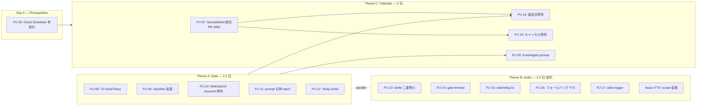

# Wave 2: Date / Audio / Calendar 3-Theme Critical UX Fixes — Handoff (2026-05-17)

> **Author**: terisuke (PM) + Claude (analysis)
> **Status**: P0 (Pre Phase 2 readiness)
> **Branch**: `fix/wave2-date-audio-calendar`
> **Scope**: 3 themes (A: Date / B: Audio / C: Calendar) → 1 Epic + 3 Theme sub-epics + 13 sub-issues + Issue #770 scope expansion
> **Expected effort**: 5〜7 営業日 (Theme A: 1-2 日 → Theme C: 2 日 直列、Theme B: 2-3 日 並列)
> **Prerequisites**: Phase A0/A1 readiness 6 FU (FU-01〜06) は別ハンドオフ (`docs/plans/phase2-readiness-handoff-2026-05-17.md`) で並行進行中
> **Blocks**: Phase 2 (Semantic Router 三段カスケード / hierarchical Store namespace)

---

## 0. Executive Summary

Wave 2 は、ADR-024 Phase 2 (Semantic Router + hierarchical Store) 着手前に塞ぐべき **3 つの critical UX バグ** をまとめた緊急ウェーブ。本日 (2026-05-17) のライブ検証で、以下の致命的な事象を観測した:

| # | 観測事象 | ユーザー影響 | テーマ |
|---|---------|------------|--------|
| 1 | 「本日は何月何日ですか」→ **「5月24日」** と回答 (実際は 5/17) | 受付・案内が成立しない | **Theme A** (日付) |
| 2 | イベント案内応答時、**Thinking モーション継続 + 音声出力なし → 画面消灯/再点灯で復旧** | 来訪者がエラーと判断、立ち去る | **Theme B** (音声) |
| 3 | Google カレンダー直近取得が空 + Spreadsheet (Apps Script SoT) と非統合 | イベント当日案内ができない | **Theme C** (カレンダー) |

**3 テーマの依存関係:**

```
Theme A (日付決定論) ───┐
                       ├──→ Theme C (カレンダー)  ※日付決定が前提
Theme B (音声信頼性) ──┘                          ※フロント独立、A/C と並列可
```

- **Theme A → Theme C 直列必須**: 「今週のイベント」の `今週` を決定するには、まず「今日」が正確である必要がある。
- **Theme B 並列可**: フロントエンド audio queue / VoiceController の race condition なので、Backend 日付・カレンダーとは独立修正可能。

---

## 1. Background — なぜ今このウェーブが必要か

### 1.1 Phase A0/A1 readiness FU-01〜06 (別ハンドオフ) との関係

| ハンドオフ | カバー範囲 | 担当 |
|-----------|----------|------|
| `phase2-readiness-handoff-2026-05-17.md` (既存) | provider/model 伝播、cron deploy、memory probe、msgpack 登録、E2E proof | Backend / Infra |
| **本ドキュメント (Wave 2)** | 日付決定論、音声出力 reliability、カレンダー modernization | Backend / Frontend / Infra |

両方を完了して初めて Phase 2 (Semantic Router cascade + critic_node) の安全な実装が可能。

### 1.2 直近のライブ証跡

**Date hallucination (request_id `ea228b3140454210`, 2026-05-17T06:13:56Z):**

```
User: "今日は何月何日ですか"
→ GeneralKnowledgeAgent ルーティング
→ WebSearchTool.search() 起動 (Tavily, 1104 chars, 5 sources)
→ Cerebras gpt-oss-120b LLM 推論
→ Response: "本日は2026年5月24日です..."
```

**Cloud Run TZ 確認:**

```bash
$ gcloud run services describe engineer-cafe-backend \
    --region=asia-northeast1 --format='value(spec.template.spec.containers[0].env)'
# TZ env var: (未設定 → デフォルト UTC)
```

**Audio stuck (manual repro, 2026-05-17 朝):**

- イベント案内クエリ → Thinking モーション点灯
- TTS chunk 1 ストリーミング開始も `playAudio()` Promise が return しない
- VoiceController state machine: `thinking` 継続、`notifySpeaking()` 未呼出
- 画面消灯 → 再点灯 → user-interaction-gate 通過 → 復旧

---

## 2. Theme A: 日付・時刻クエリの確実性 (FU-08〜12)

### 2.1 ゴール

LLM が「今日」「明日」「現在時刻」を **必ず正しく** 回答できる。Web 検索結果の古い日付に引きずられない。

### 2.2 Root Cause

| 層 | 問題 | Evidence |
|----|------|---------|
| Cloud Run | TZ 未設定 (UTC) | `gcloud run services describe` 出力に `TZ` なし |
| `query_classifier.py:191-213` | `_is_current_time_query` に「今日」「本日」「日付」が欠落 → `current_time` route に乗らず、GeneralKnowledge に流れる | `_CURRENT_TIME_KEYWORDS = ["現在時刻", "今何時", "時刻を教えて", ...]` |
| `tools/web_search.py:7-32` | `_WEB_SEARCH_KEYWORDS` に「今日」を含む → 即 Tavily 検索 | 「今日は何月何日」が Web 検索に流れた根本原因 |
| `tools/tavily_search.py:42-92` | search() の戻り `text` に **現在日付の prefix を入れていない** → LLM が web スニペット内の他日付に引っ張られて hallucinate | `text = answer + "\n\n" + sources[:3].content` のみ |
| `agents/general_knowledge_agent.py` | system prompt / human prompt に `datetime.now(JST)` を inject していない | LLM が「今日」を知らない |

### 2.3 修正項目

#### FU-08 [P0]: Cloud Run TZ=Asia/Tokyo 固定
- **File / Where**: `Dockerfile.backend` + Cloud Run service env
- **Change**:
  ```dockerfile
  ENV TZ=Asia/Tokyo
  RUN ln -snf /usr/share/zoneinfo/$TZ /etc/localtime && echo $TZ > /etc/timezone
  ```
  + `gcloud run services update engineer-cafe-backend --update-env-vars=TZ=Asia/Tokyo --region=asia-northeast1`
- **Verification**:
  ```bash
  curl -sS https://engineer-cafe-backend-639959525777.asia-northeast1.run.app/api/debug/now
  # expect: { "utc": "...", "jst": "2026-05-17T..." }
  ```

#### FU-09 [P0]: `query_classifier._is_current_time_query` 拡張
- **File**: `backend/utils/query_classifier.py:191-213`
- **Change**: `_CURRENT_TIME_KEYWORDS` に追加
  ```python
  _CURRENT_TIME_KEYWORDS = [
      # 既存
      "現在時刻", "今何時", "時刻を教えて", "what time", "current time",
      # 追加 (FU-09)
      "今日は何月何日", "今日の日付", "本日は", "本日の日付",
      "日付", "何日", "what date", "today's date", "today is",
      "明日は", "昨日は", "tomorrow", "yesterday",
  ]
  ```
- **Routing 変更**: マッチしたら `route = "current_time"` で `agent_tools.get_now_jst()` を **LLM 介さず** 直接返す
- **Verification**: `pytest backend/tests/test_query_classifier.py::test_current_time_keywords -v`

#### FU-10 [P0]: `WebSearchTool` から「今日/明日/昨日」を除外
- **File**: `backend/tools/web_search.py:7-32`
- **Change**: `_WEB_SEARCH_KEYWORDS` から「今日」「明日」「昨日」を除去。代わりに `_CURRENT_TIME_KEYWORDS` が先に hit するルーティング順序を保証
- **Verification**: `pytest backend/tests/test_web_search.py::test_no_date_trigger -v`

#### FU-11 [P0]: GeneralKnowledgeAgent prompt に現在日時 inject
- **File**: `backend/agents/general_knowledge_agent.py`
- **Change**: prompt 構築直前に
  ```python
  from backend.utils.time_utils import get_now_jst
  now = get_now_jst()
  system_prompt += f"\n\n[現在日時 (JST)]\n{now.strftime('%Y年%m月%d日 (%a) %H時%M分')}"
  ```
- **Verification**: 「今日は何月何日?」で 5/17 が返ること (live curl test)

#### FU-12 [P1]: Tavily 結果に「検索実行日時」prefix 付与 (hallucination 防止)
- **File**: `backend/tools/tavily_search.py:42-92`
- **Change**: `search()` の戻り `text` の先頭に
  ```python
  prefix = f"[検索実行日時: {get_now_jst().strftime('%Y-%m-%d %H:%M JST')}]\n以下の Web 検索結果は過去日付を含む可能性があります。日付関連の質問は本日付を基準にしてください。\n\n"
  text = prefix + answer + "\n\n" + ...
  ```
- **Verification**: `pytest backend/tests/test_tavily_search.py::test_date_prefix -v`

### 2.4 Theme A 完了条件

- [ ] `curl /api/chat` で「今日は何月何日?」→ 「2026年5月17日」(±1日許容なし)
- [ ] `curl /api/chat` で「明日は?」→ 「2026年5月18日」
- [ ] Tavily 経由でも日付関連は誤回答ゼロ (10 サンプル手動 / E2E 自動)
- [ ] Cloud Run rev ログに `JST` timestamp が出る
- [ ] PR コミット quality: ruff + black + pytest 全 PASS

---

## 3. Theme B: Lipsync / 音声出力の信頼性 (FU-13〜17 + Issue #770 P0)

### 3.1 ゴール

Thinking → Speaking → Idle の state machine が **必ず** 完遂する。音声出力が失敗しても 5 秒以内に thinking から復帰する。

### 3.2 Root Cause

| 層 | 問題 | Evidence |
|----|------|---------|
| `audio-queue.ts:166-172` | `onError` callback で `settle()` が double-fire 可能 → `onPlaybackEnd` 二重発火 | Issue #770 Item 2 |
| `audio-user-interaction-gate.ts` | `pendingCallbacks: Set<>` に user タップ待ちで **無限停滞** (タイムアウトなし) | screen toggle で `user-interaction` 再発火して復旧した症状と一致 |
| `VoiceInterface.tsx:1038` | `onPlaybackEnd: () => { cleanup(); completeAssistantTurn(); }` が gate 内で死ぬと VoiceController に通知されない | thinking 継続の直接原因 |
| `useVoiceSessionController.ts:218` | `notifySpeaking` / `notifySpeakingComplete` が timeout なしで state を抜けない | watchdog 不在 |
| frontend 全般 | エラー時の fallback 音声 (e.g. 「申し訳ありません、もう一度お試しください」) なし | UX 上ユーザーがエラーと気付けない |

### 3.3 修正項目

#### FU-13 [P0]: Audio queue settle 二重発火対策 (Issue #770 Item 2 統合)
- **File**: `frontend/src/lib/audio-queue.ts:166-172`
- **Change**:
  ```ts
  let settled = false;
  const settle = (fn: () => void) => {
    if (settled) return;
    settled = true;
    fn();
  };
  ```
- **Verification**: vitest unit test + 既存 #770 reproduction script で 1 回のみ発火確認

#### FU-14 [P0]: user-interaction-gate timeout + bypass
- **File**: `frontend/src/lib/audio/audio-user-interaction-gate.ts`
- **Change**:
  - `pendingCallbacks` に `Promise.race([userTap, sleep(8_000)])` を追加 (8 秒で gate 強制通過)
  - 第二発話以降は `hasInteracted=true` を `sessionStorage` に永続化して **二度と gate に入らない**
- **Verification**: Playwright E2E (screen toggle なしで連続発話が再生されること)

#### FU-15 [P0]: VoiceController thinking watchdog (5 秒)
- **File**: `frontend/src/app/hooks/useVoiceSessionController.ts:218` 周辺
- **Change**: `notifySpeaking` が来ない場合 5 秒で `setError("audio_timeout")` → state を `idle` に戻す + ログ送信
- **Verification**: 手動で audio API モック → 5 秒で復帰すること

#### FU-16 [P1]: フォールバック TTS (失敗時アナウンス)
- **File**: `frontend/src/app/components/VoiceInterface.tsx`
- **Change**: `onPlaybackEnd` が watchdog 経由で来た場合、エラー音 (短い beep) + 「もう一度お試しください」TTS を再生
- **Verification**: 手動 + Playwright

#### FU-17 [P1]: VoiceController state transition logger
- **File**: `frontend/src/app/hooks/useVoiceSessionController.ts`
- **Change**: state 変化を `console.debug` (NOT `console.log`, hook violation 回避) + Datadog/Sentry にイベント送信
- **Verification**: 開発ツール console で `[VoiceController] thinking → speaking (latency=234ms)` が出ること

#### Issue #770 [P2 → P0]: スコープ拡張
- **Original scope**: Audio playback race condition (Item 1 + Item 2)
- **拡張後**: Item 1/2 + FU-13〜17 を全部含む Audio Reliability 統合 Issue
- **Title 変更**: `[P0][Theme B] Audio playback reliability (FU-13〜17 + original Item 1/2)`
- **Verification**: Issue body を更新し、Theme B Sub-Epic からリンク

### 3.4 Theme B 完了条件

- [ ] **連続 3 発話** を画面操作なしで完遂 (Playwright)
- [ ] 任意の audio エラーで thinking から 5 秒以内に復帰
- [ ] エラー時にフォールバック音声が流れる
- [ ] `frontend-playwright-e2e` job PASS + 新規 audio-reliability spec 追加
- [ ] PR コミット quality: pnpm lint + typecheck + build 全 PASS

---

## 4. Theme C: Calendar / Event 信頼性 (FU-02 + FU-07 + FU-18〜20)

### 4.1 ゴール

「今日のイベント」「今週のイベント」「今月のイベント」に **正確で漏れがない** 一覧を返す。Spreadsheet (Apps Script SoT) と Calendar を統合し、ノイズ event を除外する。

### 4.2 Root Cause + 既知 followup

| 層 | 問題 | Evidence / Issue |
|----|------|----------------|
| Cloud Scheduler API | 未有効化 → KB sync cron 動かず | **FU-02** (Issue #844, separate handoff) |
| Spreadsheet 統合 | Apps Script の `alert_discord` SoT を Backend が使っていない | **FU-07** (Issue #851, PR #852 OPEN) |
| `calendar_service._calculate_time_range` | `thisWeek` が Mon-Sun で **過去日含む** | `tools/calendar_service.py:124-129` |
| `_NOISE_SUMMARIES` | "Busy" のみ filter、「キャンセル」prefix が漏れる | `tools/calendar_service.py:18` |
| EventAgent | 「今週」「今日」など範囲指定が曖昧 | LLM prompt に範囲解釈ルールなし |
| ICS feed | 終了済 event も含む → 古いイベントを返す可能性 | observation |

### 4.3 修正項目

#### FU-02 [既存 Issue #844]: Cloud Scheduler 有効化 + KB cron deploy
- **Status**: 別ハンドオフ (`phase2-readiness-handoff-2026-05-17.md` PR-M) で進行中
- **Wave 2 関係**: Theme C の前提条件。Theme C 開始前に完了済を確認する Day 0 task

#### FU-07 [既存 Issue #851 / PR #852]: Spreadsheet (Apps Script SoT) 統合
- **Status**: PR #852 OPEN (`fix/phase2-readiness-fu07-event-spreadsheet`)
- **Wave 2 関係**: Theme C の base layer。merge 順序: FU-07 → FU-18〜20

#### FU-18 [P0]: `_calculate_time_range` で過去日除外
- **File**: `backend/tools/calendar_service.py:124-129`
- **Change**:
  ```python
  def _calculate_time_range(self, scope: str) -> tuple[datetime, datetime]:
      now = get_now_jst()  # FU-08 (TZ) + FU-11 適用後
      if scope == "today":
          start = now.replace(hour=0, minute=0, second=0)
          end = start + timedelta(days=1)
      elif scope == "thisWeek":
          start = now  # 過去日除外 (旧: monday of this week)
          end = (now + timedelta(days=7)).replace(hour=23, minute=59)
      elif scope == "thisMonth":
          start = now  # 過去日除外
          end = (now + relativedelta(months=1)).replace(hour=23, minute=59)
      ...
  ```
- **Verification**: `pytest backend/tests/test_calendar_service.py::test_time_range_excludes_past -v`

#### FU-19 [P0]: `_NOISE_SUMMARIES` 拡張 + キャンセル event 除外
- **File**: `backend/tools/calendar_service.py:18`
- **Change**:
  ```python
  _NOISE_SUMMARIES = {"Busy", "予定あり", "ブロック"}
  _NOISE_PREFIXES = ("キャンセル", "中止", "[CANCELLED]", "[CANCELED]")

  def _is_noise(self, summary: str) -> bool:
      if summary in self._NOISE_SUMMARIES:
          return True
      return any(summary.startswith(p) for p in self._NOISE_PREFIXES)
  ```
- **Verification**: unit test で実 ICS feed の noise event が除外されること

#### FU-20 [P1]: EventAgent prompt に範囲解釈ルール明示
- **File**: `backend/agents/event_agent.py`
- **Change**: system prompt に
  ```
  範囲解釈ルール (JST 基準, 現在日時は [現在日時] フィールドを参照):
  - 「今日」: 本日 00:00 〜 翌日 00:00
  - 「明日」: 翌日 00:00 〜 翌々日 00:00
  - 「今週」: 本日 〜 7 日後 23:59 (過去日含まず)
  - 「今月」: 本日 〜 1 ヶ月後 23:59 (過去日含まず)
  - 「来週」: 7 日後 〜 14 日後
  ```
- **Verification**: live test 10 サンプル + RAGAS

### 4.4 Theme C 完了条件

- [ ] `curl /api/chat "今日のイベントは?"` → 当日分のみ正確に返る (FU-07 Spreadsheet 経由)
- [ ] 「今週のイベント」→ 過去日含まず、7 日以内のみ
- [ ] キャンセル event が出力に含まれない
- [ ] Cloud Scheduler cron が deploy 済 + 12h 周期で動作 (FU-02)
- [ ] RAGAS event ground truth 更新 + 0.85 以上 (ja)

---

## 5. 全体依存グラフ + 推奨 PR 分割



### 推奨 PR 分割

| PR | Branch | Scope | 担当推奨 |
|----|--------|-------|---------|
| **PR-W2A** | `fix/wave2-theme-a-date` | FU-08〜12 (Theme A 全部) | Backend |
| **PR-W2B-1** | `fix/wave2-theme-b-audio-core` | FU-13〜15 (Issue #770 Item 1/2 含む) | Frontend |
| **PR-W2B-2** | `fix/wave2-theme-b-audio-ux` | FU-16, FU-17 (UX improvement) | Frontend |
| **PR-W2C-1** | `fix/wave2-theme-c-calendar-filter` | FU-18, FU-19 (calendar_service) | Backend |
| **PR-W2C-2** | `fix/wave2-theme-c-event-prompt` | FU-20 (event_agent) | Backend |
| **既存 PR #852** | `fix/phase2-readiness-fu07-event-spreadsheet` | FU-07 | Backend |
| **既存 PR-M** | (別ハンドオフ) | FU-02 (Cloud Scheduler) | Infra |

**Merge 順序:**

```
Day 0:    PR-M (FU-02) ─────────────────────────────────────────→ merged
Day 1:    PR-W2A (Theme A 全部) ────────┬─→ merged
          PR-W2B-1 (Audio core) ────────┼─→ merged
Day 2-3:  PR-W2B-2 (Audio UX) ──────────┼─→ merged
          PR #852 (FU-07) ──────────────┼─→ merged
Day 4-5:  PR-W2C-1 (calendar_service) ──┼─→ merged   ※ Theme A + #852 merge 後
          PR-W2C-2 (event_agent) ───────┴─→ merged
Day 6-7:  Live 検証 + RAGAS + E2E
```

---

## 6. Daily Schedule (5〜7 営業日想定)

| Day | 担当 | タスク |
|-----|------|-------|
| **Day 0** | terisuke | `gcloud services enable cloudscheduler.googleapis.com` (FU-02 prerequisite) |
| **Day 0** | terisuke | Cloud Run `--update-env-vars TZ=Asia/Tokyo` (FU-08) |
| **Day 1** | Backend | PR-W2A (FU-08〜12) 実装 + ローカルテスト |
| **Day 1** | Frontend | PR-W2B-1 (FU-13〜15) 実装 + Playwright |
| **Day 2** | Backend | PR-W2A live 検証 + merge |
| **Day 2** | Frontend | PR-W2B-2 (FU-16〜17) 実装 |
| **Day 2** | Backend | PR #852 (FU-07) review 完了 + merge |
| **Day 3** | Backend | PR-W2C-1 (FU-18〜19) 実装 + テスト |
| **Day 3** | Frontend | PR-W2B-2 review + merge |
| **Day 4** | Backend | PR-W2C-2 (FU-20) 実装 + RAGAS 再評価 |
| **Day 4** | Backend | PR-W2C-1 + PR-W2C-2 merge |
| **Day 5** | All | Wave 2 統合検証 (3 テーマ全条件パス確認) |
| **Day 6-7** | All | 緩衝日 (regression 修正 / docs / Memory 更新) |

並列可能: Theme A / Theme B / FU-07
直列必須: Theme A → Theme C 内の FU-18, FU-20 / FU-07 → FU-18 / FU-19

---

## 7. Tracking — GitHub Issue 構成

### Epic (新規)

- **[Epic][Wave 2] Date / Audio / Calendar 3-theme critical UX fixes (Pre Phase 2 readiness)**
  - Labels: `epic`, `wave-2`, `P0`, `pre-phase-2`
  - Linked PRs: PR-W2A, PR-W2B-1, PR-W2B-2, PR-W2C-1, PR-W2C-2, PR #852, PR-M
  - Closes: 全 13 sub-issue (FU-08〜20) + Issue #770 scope expansion

### Theme Sub-Epics (3 個、新規)

| Sub-Epic | カバー | 担当 |
|----------|-------|------|
| **[Theme A][Wave 2] Date determinism (FU-08〜12)** | TZ + classifier + WebSearch + prompt inject + Tavily prefix | Backend |
| **[Theme B][Wave 2] Audio playback reliability (FU-13〜17 + Issue #770)** | settle / gate / watchdog / fallback / logger | Frontend |
| **[Theme C][Wave 2] Calendar modernization (FU-02 + FU-07 + FU-18〜20)** | Scheduler + Spreadsheet + 過去日除外 + キャンセル除外 + prompt | Backend / Infra |

### Sub-Issues (13 個、新規)

| ID | Title | Theme | Priority |
|----|-------|-------|----------|
| FU-08 | `[P0][FU-08] Cloud Run TZ=Asia/Tokyo 固定` | A | P0 |
| FU-09 | `[P0][FU-09] query_classifier に今日/明日/日付 keyword 追加` | A | P0 |
| FU-10 | `[P0][FU-10] WebSearch keyword から「今日/明日/昨日」除外` | A | P0 |
| FU-11 | `[P0][FU-11] GeneralKnowledgeAgent prompt に現在日時 inject` | A | P0 |
| FU-12 | `[P1][FU-12] Tavily 結果に検索実行日時 prefix 付与` | A | P1 |
| FU-13 | `[P0][FU-13] audio-queue settle 二重発火対策 (Issue #770 Item 2 統合)` | B | P0 |
| FU-14 | `[P0][FU-14] user-interaction-gate に 8s timeout + sessionStorage bypass` | B | P0 |
| FU-15 | `[P0][FU-15] VoiceController thinking watchdog 5s` | B | P0 |
| FU-16 | `[P1][FU-16] 音声失敗時のフォールバック TTS` | B | P1 |
| FU-17 | `[P1][FU-17] VoiceController state transition logger` | B | P1 |
| FU-18 | `[P0][FU-18] calendar_service._calculate_time_range で過去日除外` | C | P0 |
| FU-19 | `[P0][FU-19] _NOISE_SUMMARIES 拡張 + キャンセル prefix 除外` | C | P0 |
| FU-20 | `[P1][FU-20] EventAgent prompt に範囲解釈ルール明示` | C | P1 |

### 既存 Issue 更新

| Issue | アクション |
|-------|----------|
| **#770** | Title → `[P0][Theme B] Audio playback reliability (FU-13〜17 + original Item 1/2)`, Priority P2 → P0, body に Theme B Sub-Epic リンク追加 |
| **#842** | コメントで Wave 2 Epic リンク (Phase A0/A1 readiness Epic) |
| **#844** | コメントで Theme C との関係明示 (FU-02) |
| **#851** | コメントで Theme C との関係明示 (FU-07) |

---

## 8. Verification & Exit Criteria

### Wave 2 全体 GO 条件

- [ ] **Theme A**: 「本日は何月何日?」「明日は?」「今週のイベント?」全て JST 正確 (10 サンプル / 言語 × 4 言語)
- [ ] **Theme B**: 連続 3 発話を画面操作なし完遂 (Playwright `audio-reliability.spec.ts` PASS)
- [ ] **Theme C**: 「今日/今週/今月のイベント」一覧が Spreadsheet SoT と一致 (FU-07 経由)
- [ ] **CI**: 全 PR の `pnpm lint + typecheck + build` + `ruff + black + pytest` PASS
- [ ] **RAGAS**: ja >= 0.85 / en >= 0.75 / zh/ko >= 0.65 維持
- [ ] **Live**: Cloud Run rev 更新 + manual smoke test PASS
- [ ] **Memory**: MEMORY.md に `project_wave2_completion_20260524.md` (見込) を追加
- [ ] **Phase 2 着手可**: Phase A0/A1 + Wave 2 両方完了

---

## 9. Open Questions / Risks

| # | Question / Risk | Owner | 期限 |
|---|----------------|-------|------|
| Q1 | FU-15 watchdog 5s は適切か？(短すぎると正常 LLM 推論を中断) | Frontend | Day 1 |
| Q2 | FU-14 sessionStorage bypass は iOS Safari kiosk mode で動作するか? | Frontend | Day 1 |
| Q3 | FU-18 過去日除外で「9時開始イベント (現在 10時)」を含めるか? | Backend / PM | Day 2 |
| Q4 | FU-12 Tavily prefix で full-text LLM context が膨張するリスク | Backend | Day 1 |
| R1 | PR-W2A merge 後の RAGAS 一時的低下 (prompt 改修影響) | Backend | Day 2 |
| R2 | Theme B フォールバック TTS で「もう一度...」がループ再生する可能性 | Frontend | Day 2 |

---

## 10. Reference Files

- `docs/plans/phase2-readiness-handoff-2026-05-17.md` — Phase A0/A1 readiness 6 FU 並行ハンドオフ
- `docs/plans/event-source-spreadsheet-integration-2026-05-17.md` — FU-07 Spreadsheet 統合詳細
- `docs/adr/024-memory-and-reception-modernization.md` — Phase A0/A1 達成状況表
- `backend/utils/query_classifier.py:191-213` — `_is_current_time_query`
- `backend/tools/web_search.py:7-32` — `_WEB_SEARCH_KEYWORDS`
- `backend/tools/tavily_search.py:42-92` — `TavilySearchTool.search()`
- `backend/tools/calendar_service.py:18,124-129` — noise filter + time range
- `frontend/src/lib/audio-queue.ts:166-172` — onError settle
- `frontend/src/lib/audio/audio-user-interaction-gate.ts` — pending callbacks
- `frontend/src/app/components/VoiceInterface.tsx:1038` — onPlaybackEnd handler
- `frontend/src/app/hooks/useVoiceSessionController.ts:218` — notifySpeaking
