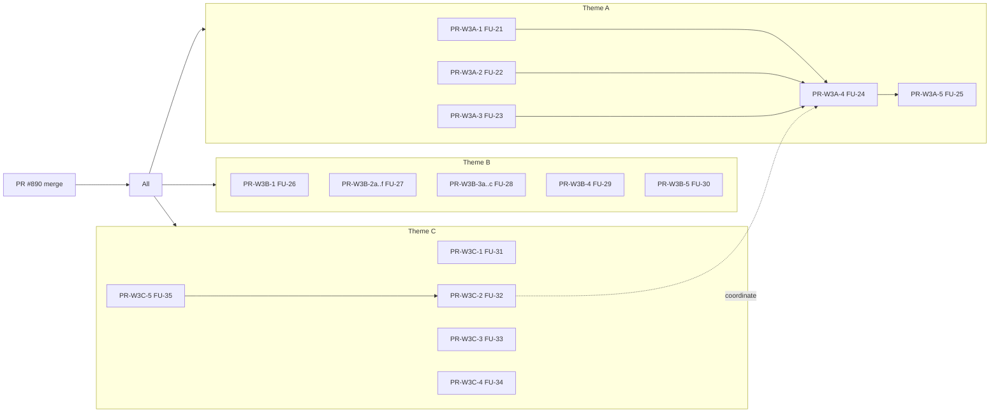

# 🛠️ Wave 3 Engineer Handoff (Master) — Pre Phase 2 Foundation Hardening

> **対象**: Wave 3 を実装する Backend / Frontend / Infra エンジニア全員
> **作成**: 2026-05-18, Claude Code session (terisuke 指示)
> **目的**: Phase 2 (ADR-023 Semantic Router 三段カスケード) 着手前に「ログ・観測性・コード/ドキュメント整理・OSS portability」を完成させ、Phase 2 実装をスムーズにする
> **このドキュメント 1 ファイルで作業着手可能** (他 doc は参照用、必須ではない)

---

## 📑 目次

- [§0 これは何 / 必読 1 分要約](#0-これは何--必読-1-分要約)
- [§1 背景: なぜ Wave 3 が必要か](#1-背景-なぜ-wave-3-が必要か)
- [§2 ゴール / 非ゴール](#2-ゴール--非ゴール)
- [§3 監査で確定した事実 (実測 evidence)](#3-監査で確定した事実-実測-evidence)
- [§4 3 テーマ全体像](#4-3-テーマ全体像)
- [§5 アーキテクチャ決定 (ADR-027 + ADR-028 要約)](#5-アーキテクチャ決定-adr-027--adr-028-要約)
- [§6 全 15 sub-issues 詳細仕様](#6-全-15-sub-issues-詳細仕様)
- [§7 PR 分割・依存関係・並列性](#7-pr-分割依存関係並列性)
- [§8 10〜14 営業日 Daily Schedule](#8-10-14-営業日-daily-schedule)
- [§9 担当別 First-Day Checklist](#9-担当別-first-day-checklist)
- [§10 Exit Criteria (Wave 3 完了条件)](#10-exit-criteria-wave-3-完了条件)
- [§11 Risk Register & Mitigation](#11-risk-register--mitigation)
- [§12 コーディング規約 (再確認)](#12-コーディング規約-再確認)
- [§13 検証 / Live smoke / regression 確認手順](#13-検証--live-smoke--regression-確認手順)
- [§14 Reference: ADR / Issue / 関連 PR](#14-reference-adr--issue--関連-pr)

---

## §0 これは何 / 必読 1 分要約

**Wave 3** は Pre Phase 2 Foundation Hardening:

1. **Observability** — 定期ログ確認で会話・音声 I/O・agent routing が期待通りか分かる。閾値超過で `company@cor-jp.com` に自動 email alert
2. **Refactoring** — Wave 2 で肥大化した Backend 17 file / Frontend 6 file (≥800 行) の分割、dead code 削除、docs 整理
3. **OSS Portability** — ISC license で OSS 公開しているが infra/CI が GCP-locked → OpenTelemetry + Grafana stack + docker-compose で OSS deployer も self-host 可能に

**実装単位**: 1 Epic + 3 Theme + 15 sub-issues + 約 18 PR、**並列実行で 10〜14 営業日**
**人員想定**: Backend 2〜3 + Frontend 1〜2 + Infra 1
**着手前提**: 本 PR (#890) が develop に merged されること
**ゴール**: Phase 2 (Semantic Router cascade) 着手時に observability + clean codebase が揃っている状態

---

## §1 背景: なぜ Wave 3 が必要か

### 1.1 Wave 2 完了直後の独立検証で 3 つの critical gap が判明

| Gap | 実態 | 影響 |
|-----|------|------|
| **Observability 未整備** | Cloud Monitoring alert **0** / notification channel **0** / log-based metric **0** | 運用が「raw log 目視」のみ、agent 異常を検知できない |
| **コード肥大化** | Backend ≥800 行 file **17 個**、Frontend **6 個** (top: stt_agent.py 3,033 行, VoiceInterface.tsx 1,959 行) | Phase 2 で差分が読めない、Wave 2 で追加した 3,229 行が消化されていない |
| **OSS 公開なのに GCP-locked** | infra/terraform/ 全 11 ファイル GCP only、ci.yml gcloud 26 hits、scripts/ 13 本 gcloud 使用 | ISC license で OSS と謳いながら、外部 contributor は `git clone` しても deploy 不能 |

### 1.2 terisuke からの 3 つの指示

1. > ログの整備。定期的にログを見るだけで会話が期待通りに進んでいるか、音声入出力が期待通りのスピードが出ているか、正しいエージェントにルーティングしているかをわかるようにしてほしい。一定の域を超えたエージェントの動きの問題などがあれば、クラウドログのアラートを使って **company@cor-jp.com** という管理者のアドレスに送るようにしてほしい。
2. > フロントエンドとバックエンド、全体的なリファクタリング。これだけ大規模な改修を行ったので、ドキュメントはもちろんのこと、コード自体にも無駄な部分があったりするはずなので、フェーズ 2 に入る前に、コードとドキュメントの全体整理をしておきたい。
3. > Cloud Monitoring/Alert は GCP というプラットフォームに依存している部分があるので、できればプラットフォームに依存しない logging/alert システムを実装したい。

→ 3 指示が **3 つの Theme** に 1 対 1 対応する。

---

## §2 ゴール / 非ゴール

### Goals (Wave 3 完了時に満たすべきこと)

#### Observability
- ✅ `gcloud logging read jsonPayload.event="stt_qwen_complete"` で live STT 実 latency / confidence が取れる
- ✅ `gcloud logging read jsonPayload.event="agent_routing"` で全 routing 決定が追える
- ✅ `voice_round_trip` event で STT / chat / TTS の breakdown latency が見える
- ✅ Frontend `thinking_watchdog_expire` 等の audio reliability event が Backend log に出る
- ✅ Cloud Monitoring (GCP path) **and** Prometheus/Grafana (OSS path) **の両方**で同じ alert rule が動く
- ✅ `company@cor-jp.com` に test alert が **両 path 両方から** 到達確認

#### Refactoring
- ✅ Backend `find backend -name '*.py' -not -path '*/tests/*' -exec wc -l {} + | awk '$1 >= 800'` → **0 行**
- ✅ Frontend `find frontend/src -name '*.tsx' -o -name '*.ts' | grep -v test | xargs wc -l | awk '$1 >= 800'` → **0 行**
- ✅ `npx knip` 結果 0
- ✅ `vulture backend/ --min-confidence=80` 結果 0
- ✅ `docs/plans/archive/` に 16 件移動、各 plan に status 明記
- ✅ `docs/CODEMAPS/` に backend.md / frontend.md / architecture.md
- ✅ `docs/data-flow/` に 5 endpoint audit report

#### OSS Portability
- ✅ `grep -rE "from google\.(cloud|oauth2|auth)" backend/ --include='*.py'` → **0 件** (Application 層 GCP SDK ゼロ)
- ✅ `docker compose up` で OSS deployer が 9 service 起動成功
- ✅ OSS deployer が docker-compose で `curl /api/chat` smoke 6 件 200
- ✅ DEPLOYMENT.md に Path A (GCP) + Path B (OSS docker-compose) の 2 path 完全記述

### Non-Goals (Wave 3 では実装しない、Wave 4+ 候補)

- ❌ Phase 2 Semantic Router cascade (ADR-023) — Wave 3 完了後の次フェーズ
- ❌ Memory hierarchy 再設計 (ADR-024) — 同上
- ❌ 新規エージェント追加
- ❌ Helm chart / Kubernetes manifest example
- ❌ Multi-cloud abstraction (AWS / Azure adapter)
- ❌ Frontend Vercel 脱却 (Next.js standalone は対応するが migration は別 Wave)
- ❌ BigQuery export sink
- ❌ Backend ≥800 行 file の **top 6 以外** (残 11 file は P2 で Wave 3.5 候補)
- ❌ Frontend ≥800 行 file の **top 3 以外** (残 3 file は P2 で Wave 3.5 候補)

---

## §3 監査で確定した事実 (実測 evidence)

### 3.1 Cloud Monitoring 現状 (2026-05-18 `gcloud` 実測)

```bash
$ gcloud alpha monitoring policies list --project=aipartner-426616
(空) ← 0 件

$ gcloud alpha monitoring channels list --project=aipartner-426616
(空) ← 0 件、company@cor-jp.com 未登録

$ gcloud logging metrics list --project=aipartner-426616
(空) ← 0 件
```

### 3.2 既存 observability 資産

| 種別 | 既存箇所 | 状態 |
|------|---------|------|
| structured logger | `backend/observability/structured_logger.py` | ✅ 既存、chat_response / memory_* 動作中 |
| GCP terraform | `infra/terraform/{alerts,dashboard,log_metrics,secrets}.tf` | ✅ Issue #513 Phase 1b で land 済、notification_channel 未設定 |
| Alpha live proof | `scripts/onsite-voice-live-proof.sh` | ✅ 既存、Wave 3 で改修不要 |
| Observability runbook | `docs/observability-runbook.md` | △ Wave 3 alert を追記する FU-29 で対応 |

### 3.3 Backend 構造化ログ live 出現状況 (24h)

| Event | 定義 | live 出現 | Wave 3 対応 |
|-------|------|---------|------------|
| `chat_response` | ✅ | 22/日 | FU-22 で field 追加 |
| `memory_*` (5 種) | ✅ | 44/日 (各) | 既に OK |
| `stt_qwen_complete` | ✅ 定義のみ | 0/日 | FU-21 で call site 実装 |
| `stt_winner` | ✅ 定義のみ | 0/日 | FU-21 |
| `tts_synthesis_*` | ❌ 未定義 | 0/日 | FU-21 で定義 + call site |
| `agent_routing` | ❌ 未定義 | 0/日 | FU-22 で新設 |
| `voice_round_trip` | ❌ 未定義 | 0/日 | FU-22 で新設 |

### 3.4 大ファイル一覧 (実測 `git ls-tree origin/develop` + `wc -l`)

#### Backend ≥800 行 (17 file)

| Rank | File | 行数 | Wave 3 対応 (FU-27 top 6) |
|------|------|-----:|--------------------------|
| 1 | `backend/agents/stt_agent.py` | 3,033 | ✅ 分割対象 |
| 2 | `backend/workflows/main_workflow.py` | 2,588 | ✅ 分割対象 |
| 3 | `backend/agents/facility_agent.py` | 2,071 | ✅ 分割対象 |
| 4 | `backend/main.py` | 1,984 | ✅ 分割対象 |
| 5 | `backend/tools/enhanced_rag.py` | 1,731 | ✅ 分割対象 |
| 6 | `backend/evaluation/run_live_api_eval.py` | 1,729 | ❌ Wave 3.5 (eval 系) |
| 7 | `backend/agents/business_info_agent.py` | 1,635 | ✅ 分割対象 |
| 8 | `backend/agents/voice_agent.py` | 1,610 | ❌ Wave 3.5 (FU-31 で legacy 削除後再評価) |
| 9-17 | (他 9 file 1,084〜1,360 行) | — | ❌ Wave 3.5 |

#### Frontend ≥800 行 (6 file)

| Rank | File | 行数 | Wave 3 対応 (FU-28 top 3) |
|------|------|-----:|--------------------------|
| 1 | `frontend/src/app/components/VoiceInterface.tsx` | 1,959 | ✅ 分割対象 |
| 2 | `frontend/src/app/components/CharacterAvatar.tsx` | 1,555 | ✅ 分割対象 |
| 3 | `frontend/src/app/components/ReceptionPdfGuide.tsx` | 1,304 | ✅ 分割対象 |
| 4 | `frontend/src/lib/vrm-utils.ts` | 962 | ❌ Wave 3.5 |
| 5 | `frontend/src/app/page.tsx` | 840 | ❌ Wave 3.5 |
| 6 | `frontend/src/lib/voice-recorder.ts` | 824 | ❌ Wave 3.5 |

### 3.5 GCP SDK 直接 import 実測

```bash
$ grep -rnE "^(from|import) (google\.cloud|google\.oauth2|google\.auth|googleapiclient)" backend/ --include='*.py' | grep -v tests/
backend/agents/stt_agent.py:1491:        from google.cloud import speech       # ← GoogleSTTClient (legacy fallback)
backend/agents/voice_agent.py:444:        from google.oauth2 import service_account  # ← GoogleTTSClient (legacy)
backend/agents/voice_agent.py:471:        from google.auth.transport.requests import Request as GoogleAuthRequest
```

**Frontend** (`grep -rE "@google-cloud|googleapis|gcloud" frontend/src/` ): **0 件**

→ Application 層は **2 ファイルの legacy fallback** 以外完全 portable。FU-31 で削除すると application 層 GCP SDK ゼロ。

### 3.6 docs/plans 累積状況

```bash
$ git ls-tree -r origin/develop docs/plans/ | wc -l
21
```

archive 規則なし、status (completed/active) 表示なし。FU-29 で `docs/plans/archive/` 新設 + 16 件移動。

---

## §4 3 テーマ全体像

```
#877 [Epic][Wave 3] Pre Phase 2 Foundation Hardening
│
├── #878 [Theme A] Observability & Alerting              ── 10.5 day (Backend + Infra)
│   │   定期ログで状態が分かる + 閾値超過で company@cor-jp.com に alert
│   │
│   ├── #880 FU-21 STT/TTS structured log call site       (1.5d, Backend)
│   ├── #881 FU-22 agent_routing + voice_round_trip event (1.5d, Backend)
│   ├── #882 FU-23 Frontend telemetry → Backend POST      (2.0d, FE+BE)
│   ├── #883 FU-24 log-based metrics (OTel に改定)         (1.5d, Infra)
│   └── #884 FU-25 alert + dashboard (両 path)             (2.0d, Infra)
│       *#883/#884 は ADR-028 で OSS-friendly 設計に置き換え*
│
├── #879 [Theme B] Refactoring & Documentation           ── 9.0 day (Backend + Frontend)
│   │   コード/ドキュメント整理、Phase 2 差分を読みやすく
│   │
│   ├── #885 FU-26 Dead code 削除                          (1.5d, BE+FE)
│   ├── #886 FU-27 Backend 大ファイル分割 top 6           (3.0d, Backend, 6 PR)
│   ├── #887 FU-28 Frontend 大ファイル分割 top 3          (2.5d, Frontend, 3 PR)
│   ├── #888 FU-29 docs archive + CODEMAPS                (1.0d, 誰でも)
│   └── #889 FU-30 4-point data flow audit                (1.0d, Backend)
│
└── #891 [Theme C] OSS Portability                       ── 5.0 day (BE+FE+Infra)
    │   GCP 依存から application 層を切り離し、OSS deployer が self-host 可
    │
    ├── #892 FU-31 Legacy GoogleSTTClient/TTSClient 削除  (0.5d, Backend)
    ├── #893 FU-32 docker-compose + Grafana stack         (1.5d, Infra)
    ├── #894 FU-33 Secret backend 抽象化                  (1.0d, Backend)
    ├── #895 FU-34 Cron backend 抽象化 + docs             (0.5d, Infra)
    └── #896 FU-35 DEPLOYMENT.md 2-path 改訂              (1.0d, 誰でも)
```

**並列性**:
- Theme A / Theme B / Theme C は **完全並列可能** (依存なし)
- Theme A 内: FU-21 / FU-22 並列、FU-23 は両者完了後、FU-24 は FU-21/22/23 完了後、FU-25 は FU-24 完了後
- Theme B 内: FU-26 / FU-27 / FU-28 / FU-29 / FU-30 全て並列可
- Theme C 内: FU-31 / FU-32 / FU-33 / FU-34 / FU-35 全て並列可、ただし FU-32 と Theme A FU-23 は OTel Collector 設定で coordinate 要

---

## §5 アーキテクチャ決定 (ADR-027 + ADR-028 要約)

### ADR-027 (Wave 3 Foundation Hardening) 10 Decisions

| ID | 決定 | 担当 Theme |
|----|------|----------|
| D1 | Backend 構造化ログの call site 完成 (STT/TTS/agent_routing/voice_round_trip) | A |
| D2 | Frontend telemetry を Backend に送信 (`/api/telemetry/voice`) | A |
| D3 | Cloud Logging log-based metrics 9 個 (**ADR-028 で OTel semantic convention に改定**) | A |
| D4 | Cloud Monitoring alert + notification channel (**ADR-028 で portable に改定**) | A |
| D5 | Cloud Monitoring dashboard (**ADR-028 で Grafana JSON に改定**) | A |
| D6 | Dead code 削除 (knip + ts-prune + vulture) | B |
| D7 | Backend 大ファイル分割 top 6 | B |
| D8 | Frontend 大ファイル分割 top 3 | B |
| D9 | docs/plans archive + ルート docs 更新 + CODEMAPS | B |
| D10 | 4-point data flow audit | B |

### ADR-028 (OSS Portability) 8 Decisions

| ID | 決定 | 担当 Theme |
|----|------|----------|
| D1 | OpenTelemetry SDK を application 層の標準に | A + C |
| D2 | OTel Collector を中継 hub に (GCP / OTLP / Prometheus / stdout exporter 切替) | C |
| D3 | Alert rule を Prometheus rule YAML で portable 定義 | A + C |
| D4 | Secret backend 抽象化 (`SecretProvider` interface, Env/Sops/GCP/Vault) | C |
| D5 | Cron backend 抽象化 (CLI script trigger 化) | C |
| D6 | Container hosting を deployer choice (docker-compose 追加) | C |
| D7 | Legacy GoogleSTTClient + GoogleTTSClient 削除 | C |
| D8 | DEPLOYMENT.md を 2-path (Path A GCP / Path B OSS) | C |

### 重要なアーキテクチャ画

```
┌────────────────────────────────────────────────────────────┐
│ Application Layer (vendor-neutral)                         │
│                                                            │
│ Backend (Python):                                          │
│   structured_logger (wrapped) → OpenTelemetry SDK          │
│   - log.info(extra={"event":"chat_response", ...})         │
│   - meter.create_histogram(...).record(...)                │
│                                                            │
│ Frontend (Next.js):                                        │
│   navigator.sendBeacon('/api/telemetry/voice', payload)    │
│        ↓                                                   │
│   Backend /api/telemetry/voice → OTel SDK                  │
└────────────────────────┬───────────────────────────────────┘
                         ↓
         ┌───────────────────────────────────────┐
         │ OpenTelemetry Collector (sidecar)     │
         │ - receivers: otlp                     │
         │ - exporters: (config-driven)          │
         │   * googlecloud (terisuke production) │
         │   * prometheus + loki (OSS deployer)  │
         │   * stdout (dev / CI)                 │
         └───┬───────────────────────────────┬───┘
             ↓                               ↓
   ┌─────────────────────┐         ┌──────────────────────────┐
   │ Path A: GCP         │         │ Path B: OSS Self-Hosted  │
   │ Cloud Logging       │         │ Loki (logs)              │
   │ Cloud Monitoring    │         │ Prometheus (metrics)     │
   │ Notification → Email│         │ Alertmanager → SMTP      │
   │   company@cor-jp.com│         │   company@cor-jp.com     │
   │ (既存 terraform)    │         │ (docker-compose + YAML)  │
   └─────────────────────┘         └──────────────────────────┘
                                              ↑
                                   ┌──────────┴───────┐
                                   │ Grafana          │
                                   │ - dashboard JSON │
                                   │ - alert UI       │
                                   └──────────────────┘
```

→ **同一 YAML alert rule で両 path 同じ通知**、deployer は env config で path 選択。

---

## §6 全 15 sub-issues 詳細仕様

> **Note**: 各 issue の問題定義 / 修正方針 / Verification は GitHub Issue 本文に詳細記載。本セクションは **着手順に並べた要約 + file:line 引用 + 受入条件** のみ記載。

### Theme A: Observability & Alerting (FU-21〜25)

#### 🔧 FU-21 [P0] Backend STT/TTS structured log call site (#880, 1.5d)

**問題**: `backend/observability/structured_logger.py` に `stt_qwen_complete` / `stt_winner` / `tts_cache` event が定義済だが live で 0/日 (call site 不在)。

**実装**:
- 対象 file: `backend/agents/stt_agent.py`, `backend/clients/qwen_stt_client.py`, `backend/clients/piper_plus_client.py`, `backend/services/tts_*.py`
- 全 STT/TTS path に `STT_LOGGER` / `TTS_LOGGER` 呼出を追加
- `chat_response` event に `agent_route` / `intent` / `confidence` field 追加

**ペイロード schema**:
```json
{
  "event": "stt_qwen_complete",
  "provider": "qwen-primary",
  "language": "ja",
  "audio_duration_ms": 2340,
  "latency_ms": 1820,
  "confidence": 0.94,
  "transcript_length": 18,
  "winner": true,
  "session_id": "...",
  "request_id": "..."
}
```

**受入条件**:
- [ ] `pytest backend/tests/observability/test_stt_tts_events.py` 全 PASS
- [ ] live: `gcloud logging read 'jsonPayload.event="stt_qwen_complete"' --limit 5 --freshness=1h` で実 record
- [ ] `chat_response` event に新 field 確認

---

#### 🔧 FU-22 [P0] agent_routing + voice_round_trip event (#881, 1.5d)

**問題**: agent routing 決定がログから追えない。voice round-trip 全体時間が分からない。

**実装**:
- 対象 file: `backend/agents/orchestrator_agent.py`, `backend/api/voice.py`, `backend/api/chat.py`
- 新 event `agent_routing`: `{routed_to, intent, confidence, fallback_used, alternatives: [(name, score)], latency_ms}`
- 新 event `voice_round_trip`: `{stt_ms, chat_ms, tts_ms, total_ms, success, error_type, session_id, request_id}`

**受入条件**:
- [ ] `pytest backend/tests/agents/test_orchestrator_routing_events.py` PASS
- [ ] live: `/api/voice` 1 セッション後に `agent_routing` + `voice_round_trip` + `chat_response` 3 種類 event が出る

---

#### 🔧 FU-23 [P0] Frontend telemetry → Backend POST (#882, 2.0d)

**問題**: Wave 2 FU-17 で追加した `useVoiceSessionController.ts:73` の `console.debug` はブラウザ側のみで Backend に来ない → watchdog 発火率 / fallback 発火率 / gate timeout 率が観測不能。

**実装**:
- Backend: 新 endpoint `POST /api/telemetry/voice` (auth required) → 受信して `structured_logger` 経由で Cloud Logging に転送
- Frontend: `useVoiceSessionController.ts` の state transition + watchdog expire を `navigator.sendBeacon()` で送信
- 送信 event: `voice_state_transition`, `thinking_watchdog_expire`, `fallback_tts_triggered`, `user_interaction_gate_timeout`, `audio_playback_failed`
- 既存 `console.debug` は残す (開発用)

**受入条件**:
- [ ] kiosk で連続 3 発話 → 全 transition event が backend log に出る
- [ ] Safari iOS 旧 version で `sendBeacon` failover 動作

---

#### 🔧 FU-24 [P0] Log-based metrics (ADR-028 で OTel に改定) (#883, 1.5d)

**問題**: Cloud Logging に raw log は出るが、percentile / count / distribution の集計 metric が無い。Cloud Monitoring dashboard も alert も組めない。

**実装** (ADR-028 改定後):
- OpenTelemetry semantic convention で 9 metric 定義 (vendor-neutral)
  ```python
  # backend/observability/otel_meter.py (新設)
  voice_round_trip_ms = meter.create_histogram("voice_round_trip_ms", unit="ms")
  chat_response_ms = meter.create_histogram("chat_response_ms", unit="ms")
  stt_latency_ms = meter.create_histogram("stt_latency_ms", unit="ms")
  tts_latency_ms = meter.create_histogram("tts_latency_ms", unit="ms")
  agent_route_count = meter.create_counter("agent_route_count")
  stt_winner_count = meter.create_counter("stt_winner_count")
  error_count = meter.create_counter("error_count")
  frontend_audio_watchdog_count = meter.create_counter("frontend_audio_watchdog_count")
  frontend_fallback_count = meter.create_counter("frontend_fallback_count")
  ```
- OTel Collector config (`infra/observability/otel-collector-config.yaml`) で:
  - GCP path: `exporters: googlecloud` (既存 terraform/log_metrics.tf と並走、徐々に置き換え)
  - OSS path: `exporters: prometheus` (FU-32 docker-compose で起動)

**Dependency**: FU-21 + FU-22 + FU-23 完了

**受入条件**:
- [ ] `pytest backend/tests/observability/test_otel_meter.py` PASS
- [ ] live: OTel Collector 経由で Cloud Monitoring に metric 流入 (GCP path)
- [ ] OSS path: docker-compose で Prometheus に同 metric 流入 (FU-32 と同 PR で確認)

---

#### 🔧 FU-25 [P0] Alert + Notification + Dashboard (両 path) (#884, 2.0d)

**問題**: Cloud Monitoring alert policy 0 + notification channel 0、 OSS path も無し。

**実装** (ADR-028 改定後):
- 単一 source `infra/observability/alerts.rules.yml` に Prometheus rule YAML で 7 alert 定義:

| Alert | Condition | Severity |
|-------|-----------|---------|
| `voice_round_trip_p95_slow` | `histogram_quantile(0.95, voice_round_trip_ms) > 8000` for 10min | P2 |
| `chat_response_p95_slow` | `histogram_quantile(0.95, chat_response_ms) > 6000` for 10min | P2 |
| `stt_latency_degradation` | `histogram_quantile(0.95, stt_latency_ms) > 5000` for 15min | P2 |
| `backend_error_burst` | `rate(error_count[5m]) > 4` for 10min | P1 |
| `agent_routing_skew` | `rate(agent_route_count{routed_to="fallback_general"}[30m]) / rate(agent_route_count[30m]) > 0.3` | P3 |
| `frontend_audio_watchdog_spike` | `rate(frontend_audio_watchdog_count[15m]) > 0.011` (10/15min) | P2 |
| `cloud_run_traffic_zero` | `absent(rate(chat_response_ms_count[30m]))` (12-20 JST) | P3 |

- GCP path: Python converter (`scripts/sync_alerts_to_gcp.py`) で `alerts.rules.yml` → `infra/terraform/alerts_generated.tf` 生成 (notification_channel_id 注入)
- OSS path: `infra/observability/alertmanager.yml` で SMTP receiver → `company@cor-jp.com`
- Dashboard: Grafana JSON `infra/observability/grafana/dashboards/engineer-cafe-navigator.json` (両 path 共通)

**Dependency**: FU-24 完了

**受入条件**:
- [ ] GCP path: `gcloud alpha monitoring policies list` で 7 policy 表示、test alert を fire させて company@cor-jp.com に email 到達
- [ ] OSS path: docker-compose の Alertmanager + mailhog で test alert 受信
- [ ] Dashboard 全パネル data 表示 (両 path)

---

### Theme B: Refactoring & Documentation (FU-26〜30)

#### 🧹 FU-26 [P0] Dead code 削除 (#885, 1.5d)

**実装**:
```bash
# Frontend
cd frontend
npx knip --reporter json > /tmp/knip.json
npx ts-prune > /tmp/ts-prune.txt
# Backend
cd backend
ruff check --select F401,F811 .
vulture backend/ --min-confidence=80 > /tmp/vulture.txt
```

検出された unused export / import / function を **テストが落ちないことを確認しながら** 削除。

**受入条件**:
- [ ] knip / ts-prune / vulture / ruff F401/F811 結果ゼロ
- [ ] カバレッジ ≥80% 維持
- [ ] `pnpm lint && pnpm typecheck && pnpm build` + `ruff check . && black --check . && pytest -m "not slow and not ragas"` 全 PASS

---

#### 🪓 FU-27 [P0] Backend 大ファイル分割 top 6 (#886, 3.0d, 6 PR)

**分割計画**:

| 対象 | 現行 | 分割方針 |
|------|------|---------|
| `backend/main.py` (1,984) | → | `backend/api/__init__.py` + `voice.py` + `chat.py` + `calendar.py` + `admin.py` |
| `backend/agents/stt_agent.py` (3,033) | → | `stt_agent.py` (公開 IF) + `stt/qwen_handler.py` + `stt/vosk_handler.py` + `stt/hedge.py` + `stt/postprocess.py` |
| `backend/workflows/main_workflow.py` (2,588) | → | subgraph 別 + helper module |
| `backend/agents/facility_agent.py` (2,071) | → | category 別 (hall / reception / wifi / amenity) |
| `backend/agents/business_info_agent.py` (1,635) | → | category 別 (saino_cafe / hours / pricing) |
| `backend/tools/enhanced_rag.py` (1,731) | → | pipeline stage 別 (retrieve / rerank / filter / format) |

**完了条件 (per PR)**:
- [ ] 分割後の全 file < 800 行
- [ ] 既存 unit / integration test 全 PASS
- [ ] live smoke 6 query 全 200、レスポンス文字列が分割前と 1:1 一致 (behaviorally equivalent)

---

#### 🪓 FU-28 [P0] Frontend 大ファイル分割 top 3 (#887, 2.5d, 3 PR)

**分割計画**:

| 対象 | 現行 | 分割方針 |
|------|------|---------|
| `VoiceInterface.tsx` (1,959) | → | container + `hooks/useVoicePlayback.ts` + `hooks/useFallbackTTS.ts` + `components/PlaybackController.tsx` + `components/FallbackUI.tsx` |
| `CharacterAvatar.tsx` (1,555) | → | container + `hooks/useVRMLifecycle.ts` + `hooks/useExpression.ts` + `hooks/useLipsync.ts` |
| `ReceptionPdfGuide.tsx` (1,304) | → | component 別 (render / navigation / UI) |

**完了条件 (per PR)**:
- [ ] 分割後の全 file < 800 行
- [ ] `pnpm lint && pnpm typecheck && pnpm build` PASS
- [ ] Playwright e2e PASS (特に `theme-b-audio-reliability.spec.ts`)
- [ ] VRM 表示 + lipsync 視覚的回帰なし (手動確認)

---

#### 📚 FU-29 [P1] docs archive + CODEMAPS (#888, 1.0d)

**実装**:
1. `docs/plans/archive/` 新設、以下 16 件を移動 + 各 plan 冒頭に `> Status: completed (YYYY-MM-DD) / superseded by ...` 追記:
   - production-hardening-session-2026-03-14
   - deployment-readiness-2026-03-15
   - production-integration-2026-03-16
   - qwen-cloud-run-validation-2026-04-11
   - alpha-trial-p1-remediation-2026-04-13
   - production-readiness-followup-2026-04-19
   - alpha-fast-response-implementation-2026-04-30
   - alpha-parallel-blocker-plan-2026-04-30
   - alpha-remediation-plan-2026-05-02
   - alpha-reset-plan-2026-05-03
   - comprehensive-refactoring-plan-2026-05-05
   - post-alpha-voice-rag-frontend-scope-2026-05-09
   - voice-speed-issue-closure-2026-05-16
   - reception-quality-issues-2026-05-16
   - frontend-api-separation-closure-2026-05-16
   - alpha-ui-e2e-hardening-2026-04-12
2. アクティブ残: wave2 / event-source-spreadsheet / event-spreadsheet-engineer-handoff / post-adr023-investigation / semantic-router-self-eval / **wave3 系 (本 master を含む)**
3. ルート docs 更新: `docs/STT-Implementation-Trace.md` を Wave 2 後の状態に最新化、`docs/observability-runbook.md` に Wave 3 alert 追記
4. `docs/CODEMAPS/` 新設、`/update-codemaps` skill で `backend.md`, `frontend.md`, `architecture.md` 自動生成

**受入条件**:
- [ ] `ls docs/plans/archive/` で 16 件
- [ ] STT-Implementation-Trace.md に "Wave 2" mention
- [ ] observability-runbook.md に Wave 3 metric 名 mention
- [ ] `docs/CODEMAPS/{backend,frontend,architecture}.md` 全存在

---

#### 📚 FU-30 [P1] 4-point data flow audit (#889, 1.0d)

**対象 endpoint** (Wave 2 で変更):
- `/api/voice/*` (STT + TTS proxy)
- `/api/chat` (LangGraph 全 agent)
- `/api/calendar` (Google Calendar ICS)
- `/api/reception/*` (Wave 7 subgraph)
- **NEW**: GAS Web App → `EVENT_SHEET_GAS_URL` → `SheetsEventSource` → KB

各 endpoint について `docs/data-flow/<endpoint>.md` 作成、`Client → API route → Backend → Response` の 4 セクションを **file:line 引用付き** で記録。

**受入条件**:
- [ ] `docs/data-flow/` に 5 file
- [ ] 各 file に 4 セクション存在
- [ ] file:line 引用が valid (develop branch リンク)

---

### Theme C: OSS Portability (FU-31〜35)

#### 🌱 FU-31 [P1] Legacy GoogleSTTClient/TTSClient 削除 (#892, 0.5d)

**対象 file:line**:
- `backend/agents/stt_agent.py:1491` `from google.cloud import speech` (GoogleSTTClient class)
- `backend/agents/voice_agent.py:444` `from google.oauth2 import service_account` (GoogleTTSClient class)
- `backend/agents/voice_agent.py:471` `from google.auth.transport.requests import Request as GoogleAuthRequest`

**実装**:
1. `GoogleSTTClient` クラスとその参照を削除
2. `GoogleTTSClient` クラスとその参照を削除
3. `STT_PROVIDER=google` / `TTS_PROVIDER=google` の dispatch 条件削除、env var 許容値から `google` 除外
4. `backend/requirements.txt` から `google-auth` を削除 (transitive 確認)
5. 関連 unit test 削除

**受入条件**:
- [ ] `grep -rE "from google\.(cloud|oauth2|auth)" backend/ --include='*.py'` → **0 件**
- [ ] `pytest -m "not slow"` 全 PASS
- [ ] live: `STT_PROVIDER=qwen-primary` + `TTS_PROVIDER=piper` で Wave 2 smoke 6 query regression なし

---

#### 🌱 FU-32 [P1] docker-compose.yml + Grafana stack (#893, 1.5d)

**追加 file**:
- `docker-compose.yml` (repo root)
- `infra/observability/otel-collector-config.yaml`
- `infra/observability/prometheus.yml`
- `infra/observability/loki-config.yaml`
- `infra/observability/alertmanager.yml` (SMTP receiver, target=company@cor-jp.com)
- `infra/observability/grafana/dashboards/engineer-cafe-navigator.json`

**docker-compose services** (9 個):
| Service | Image | Port |
|---------|-------|-----:|
| backend | (local Dockerfile.backend) | 8000 |
| frontend | (local Dockerfile.frontend) | 3000 |
| postgres | pgvector/pgvector:pg16 | 5432 |
| otel-collector | otel/opentelemetry-collector-contrib | 4317, 4318 |
| loki | grafana/loki | 3100 |
| prometheus | prom/prometheus | 9090 |
| grafana | grafana/grafana | 3001 |
| alertmanager | prom/alertmanager | 9093 |
| mailhog | mailhog/mailhog | 1025, 8025 |

**受入条件**:
- [ ] `docker compose up -d` で 9 service 全起動
- [ ] `curl http://localhost:8000/health` → 200
- [ ] `curl http://localhost:3000` → frontend OK
- [ ] Grafana UI (`:3001`) でログ + metrics dashboard 表示
- [ ] mailhog UI (`:8025`) で test alert mail 受信

---

#### 🌱 FU-33 [P1] Secret backend 抽象化 (#894, 1.0d)

**新規 file**: `backend/utils/secrets.py`

```python
from typing import Protocol
import os

class SecretProvider(Protocol):
    def get(self, key: str, default: str | None = None) -> str | None: ...

class EnvSecretProvider:
    def get(self, key, default=None): return os.getenv(key, default)

class SopsSecretProvider:
    def __init__(self, sops_file): ...
    def get(self, key, default=None): ...

class GcpSecretProvider:
    # Cloud Run の env bind を活用、internal は env 経由
    def get(self, key, default=None): return os.getenv(key, default)

class VaultSecretProvider:
    def __init__(self, vault_addr, token): ...
    def get(self, key, default=None): ...

def get_secret_provider() -> SecretProvider:
    backend = os.getenv("SECRET_BACKEND", "env")
    return {"env": EnvSecretProvider, "sops": SopsSecretProvider,
            "gcp": GcpSecretProvider, "vault": VaultSecretProvider}[backend]()
```

主要呼出箇所 (`SheetsEventSource`, OpenRouter client, Cerebras client, Tavily client) を `secrets.get(...)` に置き換え。

**受入条件**:
- [ ] `pytest backend/tests/utils/test_secrets.py` で 4 provider mock test PASS
- [ ] live: SECRET_BACKEND=env で Cloud Run regression なし
- [ ] `docs/deployment/secrets-sops.md` で sops 実例

---

#### 🌱 FU-34 [P1] Cron backend 抽象化 + docs (#895, 0.5d)

**実装**:
1. `backend/scripts/sync_event_kb.py` の CLI 性確認 (entry point + idempotency)
2. 新規 `docs/deployment/cron-options.md` で 4 trigger 例:
   - GCP Cloud Scheduler → Cloud Run Job (現行 production)
   - GitHub Actions cron (`.github/workflows/event-kb-sync.example.yml`)
   - systemd timer (`infra/systemd/event-kb-sync.timer.example`)
   - In-process APScheduler

**受入条件**:
- [ ] `python -m backend.scripts.sync_event_kb --help` で CLI 動作
- [ ] documentation の 4 例が copy-paste 実行可能

---

#### 🌱 FU-35 [P1] DEPLOYMENT.md 2-path 改訂 (#896, 1.0d)

**実装**: `docs/DEPLOYMENT.md` を Path A (GCP) + Path B (OSS docker-compose) の 2-path 構造に改訂。

**受入条件**:
- [ ] 新人が GCP account 無しで Path B を docker-compose で 30 分以内に起動
- [ ] terisuke が Path A セクションで現行運用が再現
- [ ] 両 path で smoke test 6 query が pass

---

## §7 PR 分割・依存関係・並列性

### 推奨 PR 一覧 (合計 約 18 PR)

#### Theme A (5 PR)
- PR-W3A-1: FU-21 STT/TTS events
- PR-W3A-2: FU-22 routing + roundtrip
- PR-W3A-3: FU-23 frontend telemetry + Backend `/api/telemetry/voice`
- PR-W3A-4: FU-24 OTel meter + Collector config
- PR-W3A-5: FU-25 alerts.rules.yml + Alertmanager config + GCP converter + Grafana JSON

#### Theme B (約 12 PR)
- PR-W3B-1: FU-26 dead code 削除
- PR-W3B-2a〜f: FU-27 backend split (6 PR、1 file/PR)
- PR-W3B-3a〜c: FU-28 frontend split (3 PR、1 file/PR)
- PR-W3B-4: FU-29 docs archive + CODEMAPS
- PR-W3B-5: FU-30 data flow audit

#### Theme C (5 PR)
- PR-W3C-1: FU-31 legacy GCP client 削除
- PR-W3C-2: FU-32 docker-compose + Grafana stack
- PR-W3C-3: FU-33 secrets abstraction
- PR-W3C-4: FU-34 cron abstraction docs
- PR-W3C-5: FU-35 DEPLOYMENT.md

### 依存グラフ



**並列実行可能**:
- 起動時: PR-W3A-1, PR-W3A-2, PR-W3A-3, PR-W3B-1, PR-W3B-2a, PR-W3B-3a, PR-W3B-4, PR-W3B-5, PR-W3C-1, PR-W3C-3, PR-W3C-4 が同時着手可能 (= 最大 **11 PR 並列**)
- FU-32 (docker-compose) と FU-24 (OTel) は config 整合性のため coordinate 必要 (同じ engineer か密 sync)

---

## §8 10〜14 営業日 Daily Schedule

```
Day 1
  BE-A: PR-W3A-1 (FU-21 STT/TTS events) 着手
  BE-B: PR-W3A-2 (FU-22 routing + roundtrip) 着手
  FE:   PR-W3A-3 (FU-23 frontend telemetry) 着手
  Infra: PR-W3C-2 (FU-32 docker-compose) 着手
  All:  PR-W3B-1 (FU-26 dead code) 着手

Day 2-3
  BE-A: PR-W3A-1 merge → PR-W3B-2a (FU-27 main.py split) 着手
  BE-B: PR-W3A-2 merge → PR-W3B-2b (FU-27 stt_agent.py split) 着手
  FE:   PR-W3A-3 merge → PR-W3B-3a (FU-28 VoiceInterface.tsx split) 着手
  Infra: PR-W3C-2 進行 + PR-W3A-4 (FU-24 OTel) coordinate
  BE-C: PR-W3C-3 (FU-33 secrets) + PR-W3C-1 (FU-31 legacy GCP 削除)

Day 4-5
  BE-A/B: PR-W3B-2 continue (workflow / facility split)
  FE:   PR-W3B-3b (FU-28 CharacterAvatar split)
  Infra: PR-W3A-4 merge → PR-W3A-5 (FU-25 alerts) 着手 + PR-W3C-4 (FU-34)
  Docs: PR-W3B-4 (FU-29 archive) 着手

Day 6-7
  BE-A/B: PR-W3B-2 final (business_info / enhanced_rag)
  FE:   PR-W3B-3c (FU-28 ReceptionPdfGuide split)
  Infra: PR-W3A-5 + PR-W3C-2 統合検証 (両 path で alert 動作)
  Docs: PR-W3B-5 (FU-30 data flow) + PR-W3C-5 (FU-35 DEPLOYMENT.md)

Day 8-9
  全 PR review + green merge
  live smoke 6 query 全 200 確認
  両 path で test alert 到達確認 (GCP / OSS)

Day 10-12 (buffer)
  regression 修正、Phase 2 readiness 最終確認

Day 13-14 (optional, 運用観察 buffer)
  metric / alert 閾値再調整、Phase 2 着手前の最終 dry-run
```

---

## §9 担当別 First-Day Checklist

### Backend Engineer (A: STT/TTS 系)
```bash
# Day 1 朝
git fetch origin develop
git checkout -b feat/wave3-stt-tts-events origin/develop

# 既存 structured_logger.py を読んで API 把握
git show origin/develop:backend/observability/structured_logger.py | less

# call site 候補をリストアップ
grep -rn "QwenSTTClient\|PiperPlus\|transcribe\|synthesize" backend/agents/ backend/clients/ backend/services/

# 既存 chat_response event 周辺を確認
grep -rn "chat_response\|CHAT_RESPONSE_EVENT" backend/

# FU-21 unit test 用 fixture 確認
ls backend/tests/observability/ || mkdir -p backend/tests/observability/

# 実装開始 → PR-W3A-1
```

### Backend Engineer (B: workflow + agent_routing 系)
```bash
git checkout -b feat/wave3-routing-events origin/develop

# orchestrator の routing 決定点をリストアップ
grep -rnE "def.*route|return.*agent|self\.agents\[" backend/agents/orchestrator_agent.py

# /api/voice の round-trip を握る箇所
grep -rn "speech_to_text\|text_to_speech\|api/voice" backend/api/

# 実装開始 → PR-W3A-2
```

### Frontend Engineer
```bash
git checkout -b feat/wave3-frontend-telemetry origin/develop

# Wave 2 で追加した useVoiceSessionController.ts:73 周辺を確認
git show origin/develop:frontend/src/app/hooks/useVoiceSessionController.ts | sed -n '60,120p'

# state transition + watchdog 発火点を握る
grep -nE "console\.debug|watchdog|fallback|gate.*timeout" frontend/src/app/hooks/useVoiceSessionController.ts frontend/src/lib/audio/audio-user-interaction-gate.ts

# 新 Backend endpoint の Backend 担当と調整 (FU-23 は coordinated implementation)

# 実装開始 → PR-W3A-3
```

### Infra Engineer
```bash
# Day 1 朝
git checkout -b feat/wave3-otel-collector origin/develop

# 既存 GCP terraform を読む
ls infra/terraform/
cat infra/terraform/log_metrics.tf
cat infra/terraform/alerts.tf
cat infra/terraform/dashboard.tf

# Cloud Monitoring 現状確認
gcloud alpha monitoring policies list --project=aipartner-426616
gcloud alpha monitoring channels list --project=aipartner-426616

# OTel Collector の Docker image 動作確認
docker run --rm otel/opentelemetry-collector-contrib:latest --help

# docker-compose に必要な service の port を整理
# 実装開始 → PR-W3C-2 (docker-compose) → PR-W3A-4 (OTel meter)
```

### Doc Engineer (誰でも可)
```bash
git checkout -b docs/wave3-archive-and-codemaps origin/develop

# 移動対象 16 件を確認
ls docs/plans/

# `/update-codemaps` skill で初版生成 (Claude Code skill)
# 実装開始 → PR-W3B-4
```

---

## §10 Exit Criteria (Wave 3 完了条件)

### Theme A
- [ ] Cloud Logging に `stt_qwen_complete` / `tts_synthesis_complete` / `agent_routing` / `voice_round_trip` event が live 発火
- [ ] Frontend `thinking_watchdog_expire` / `fallback_tts_triggered` event が Cloud Logging に出る
- [ ] **GCP path**: `gcloud alpha monitoring policies list` で 7 policy 表示、test alert が `company@cor-jp.com` に届く
- [ ] **OSS path**: docker-compose の Alertmanager + mailhog で同じ alert が test fire 確認
- [ ] Dashboard で latency / agent route 等のチャート可視化

### Theme B
- [ ] `find backend -name '*.py' -not -path '*/tests/*' -exec wc -l {} + | awk '$1 >= 800'` → 0 行
- [ ] `find frontend/src -name '*.tsx' -o -name '*.ts' | grep -v test | xargs wc -l | awk '$1 >= 800'` → 0 行
- [ ] `npx knip` / `vulture` / `ruff F401/F811` 結果ゼロ
- [ ] `docs/plans/archive/` に 16 件、ルート docs 最新化、CODEMAPS 3 file 生成
- [ ] `docs/data-flow/` に 5 endpoint audit report

### Theme C
- [ ] `grep -rE "from google\.(cloud|oauth2|auth)" backend/ --include='*.py'` → 0 件
- [ ] `docker compose up` で 9 service 全起動
- [ ] OSS deployer が docker-compose で smoke 6 query 200
- [ ] DEPLOYMENT.md に 2 path 完全記述

### 統合
- [ ] CI all green
- [ ] live regression なし (Wave 2 smoke 6 query 全成功維持)
- [ ] terisuke 本番 (rev 00218 系) で latency / error rate 悪化なし

---

## §11 Risk Register & Mitigation

| # | Risk | 影響 | Mitigation | Owner |
|---|------|------|-----------|-------|
| R1 | OpenTelemetry SDK 学習コスト | Day 1-2 で進捗遅延 | Python OTel SDK 公式 docs (https://opentelemetry.io/docs/instrumentation/python/) を Day 0 で読む。Datadog/Sentry 経験者を assign | Backend Lead |
| R2 | 大ファイル分割で import path 大量変更 → CI 緑化に時間 | 各 PR で半日ロス | 各分割 PR を 1 file ずつに限定、CI が落ちたら即 revert | Backend |
| R3 | Cloud Monitoring 月額コスト増 (metric ingestion + alert eval) | $20-50/月 (推定) | Day 0 で見積、$100/月 超えそうなら閾値再調整 | Infra |
| R4 | alert 閾値が初期過敏 → alert fatigue | 運用負荷 | 初期は **warn** 閾値のみ、運用 1 週間後に re-evaluate | Infra |
| R5 | docker-compose で Supabase 互換性問題 (pgvector 等) | OSS deployer が起動失敗 | `pgvector/pgvector:pg16` 公式 image 採用、init.sql で extension 自動有効化 | Infra |
| R6 | Frontend 分割で VRM lifecycle (CharacterAvatar) 壊す | UX regression | Playwright e2e 必須、特に lipsync 視覚的確認 | Frontend |
| R7 | terraform/cloud-monitoring と OTel Collector の二重管理 | infra 工数増 | converter (`scripts/sync_alerts_to_gcp.py`) で alerts.rules.yml を SoT 化、terraform は generated 化 | Infra |
| R8 | iPad Safari 旧 version で `navigator.sendBeacon` 不在 | telemetry 欠損 | `'sendBeacon' in navigator` 判定 + `fetch keepalive` failover | Frontend |
| R9 | Backend FU-31 で legacy GCP client 削除すると STT_PROVIDER=google が動かなくなる | env config の breaking change | env var 許容値から `google` 除外、CHANGELOG.md に明記、terisuke 本番は qwen-primary なので影響なし | Backend |
| R10 | OSS deployer の SMTP server 確保 | external dependency | docker-compose に mailhog 同梱 (開発)、production は SendGrid/Mailgun 例 documentation | Infra |
| R11 | Wave 3 工数 24.5d が想定超過 | リリース遅延 | Theme C は P1 として後回し可、Theme A/B 優先で 16.5d 達成を最低条件 | PM |
| R12 | Phase 2 着手前に Wave 3 が終わらない | Phase 2 が混沌に | Theme C が間に合わなくても Theme A/B 完了で Phase 2 着手 OK (OSS portability は Wave 3.5 に分離) | PM |

---

## §12 コーディング規約 (再確認)

(`~/.claude/rules/coding-style.md` 抜粋)

- イミュータブル: `return { ...user, name }` (ミューテーション禁止)
- 高凝集・低結合、機能/ドメイン別整理
- **関数 50 行未満、ファイル 800 行未満、ネスト 4 レベル未満**
- Zod で入力バリデーション、パラメータ化クエリ (SQL injection 防止)
- console.log 禁止、ハードコード禁止、秘密情報は環境変数 (or `secrets.get()`)

(`CLAUDE.md` 抜粋)

- Frontend: `cd frontend && pnpm lint && pnpm typecheck && pnpm build`
- Backend: `cd backend && ruff check . && black --check . && pytest -m "not slow and not ragas"`
- Docker on Apple Silicon: Use `--platform linux/amd64` when building for Cloud Run
- Cloud Run env vars: `--update-env-vars` (NOT `--set-env-vars`)
- `/api/marp` (FE) ≠ `/api/slides` (BE) — different purposes
- ALWAYS trace full data flow: client → API route → backend → response

---

## §13 検証 / Live smoke / regression 確認手順

### Standard live smoke (Wave 2 から継承)

```bash
PROJECT=aipartner-426616
API_KEY=$(gcloud secrets versions access latest --secret=API_SECRET_KEY --project=${PROJECT})
URL="https://engineer-cafe-backend-639959525777.asia-northeast1.run.app"

run_chat() {
  curl -sSL -X POST "$URL/api/chat" \
    -H "Content-Type: application/json" \
    -H "X-API-Key: $API_KEY" \
    -d "{\"query\":\"$1\",\"session_id\":\"smoke-$(date +%s%N)\",\"language\":\"ja\"}" \
    --max-time 60 | jq -r '.metadata.agent + " | " + .answer[0:100]'
}

run_chat "今日は何月何日ですか"          # GeneralKnowledgeAgent / system_clock
run_chat "今週開催されるイベントを全部教えて"  # EventAgent / spreadsheet+connpass+calendar
run_chat "ハッカソンの予定はありますか？"  # EventAgent / connpass
run_chat "Engineer Cafe のメインホールの広さは？"  # FacilityAgent / enhanced_rag
run_chat "営業時間とWi-Fiについて教えて"  # FacilityAgent / enhanced_rag
run_chat "サイノカフェのランチメニュー"  # BusinessInfoAgent / enhanced_rag

# 期待: 6/6 200 OK、agent / sources 正確
```

### Theme A 検証

```bash
# 1. STT event 確認 (FU-21 完了後)
gcloud logging read 'jsonPayload.event="stt_qwen_complete"' \
  --project=${PROJECT} --limit=5 --freshness=1h \
  --format='value(jsonPayload.latency_ms,jsonPayload.confidence,jsonPayload.provider)'

# 2. agent_routing event (FU-22)
gcloud logging read 'jsonPayload.event="agent_routing"' \
  --project=${PROJECT} --limit=5 --freshness=1h

# 3. voice_round_trip event (FU-22)
gcloud logging read 'jsonPayload.event="voice_round_trip"' \
  --project=${PROJECT} --limit=5 --freshness=1h \
  --format='value(jsonPayload.stt_ms,jsonPayload.chat_ms,jsonPayload.tts_ms,jsonPayload.total_ms)'

# 4. Frontend telemetry (FU-23)
gcloud logging read 'jsonPayload.event="thinking_watchdog_expire"' \
  --project=${PROJECT} --limit=5

# 5. Cloud Monitoring metric (FU-24)
gcloud logging metrics list --project=${PROJECT}
# expect: voice_round_trip_ms, chat_response_ms, stt_latency_ms, tts_latency_ms,
#         agent_route_count, stt_winner_count, error_count,
#         frontend_audio_watchdog_count, frontend_fallback_count

# 6. Alert policy (FU-25)
gcloud alpha monitoring policies list --project=${PROJECT} \
  --format='value(displayName,enabled)'
# expect: 7 policy, enabled=True

# 7. Notification channel
gcloud alpha monitoring channels list --project=${PROJECT}
# expect: company@cor-jp.com email channel

# 8. Test alert fire (OSS path)
docker compose -f docker-compose.yml up -d
# 意図的に latency > 8s の event を inject
# mailhog UI で alert 受信確認
```

### Theme B 検証

```bash
# File size 確認
find backend -name '*.py' -not -path '*/tests/*' -exec wc -l {} + | awk '$1 >= 800 {print}'
# expect: 空

find frontend/src -name '*.tsx' -o -name '*.ts' | grep -v test \
  | xargs wc -l | awk '$1 >= 800 {print}'
# expect: 空

# Dead code
cd frontend && npx knip && npx ts-prune
cd backend && ruff check --select F401,F811 . && vulture . --min-confidence=80

# docs
ls docs/plans/archive/ | wc -l  # expect: 16
ls docs/CODEMAPS/                # expect: backend.md, frontend.md, architecture.md
ls docs/data-flow/               # expect: 5 file
```

### Theme C 検証

```bash
# GCP SDK 完全除去
grep -rE "from google\.(cloud|oauth2|auth)" backend/ --include='*.py' | grep -v tests/
# expect: 空

# docker-compose 起動
docker compose up -d
sleep 30
docker compose ps
# expect: 9 service all "Up"

# Smoke (OSS path)
curl -sSL http://localhost:8000/health         # expect: 200
curl -sSL http://localhost:3000                # expect: 200
curl -sSL http://localhost:3001                # expect: Grafana login
curl -sSL http://localhost:9090/-/healthy      # expect: Prometheus OK
curl -sSL http://localhost:9093/-/healthy      # expect: Alertmanager OK
curl -sSL http://localhost:8025                # expect: Mailhog UI

# OSS smoke の 6 query (上記 run_chat と同じ、URL を http://localhost:8000 に変更)
```

---

## §14 Reference: ADR / Issue / 関連 PR

### ADR
- [ADR-027 Wave 3 Foundation Hardening](../adr/027-wave3-observability-and-refactor-foundation.md) — 全体設計、10 Decision
- [ADR-028 OSS-Portable Observability](../adr/028-oss-portable-observability-and-infrastructure.md) — OSS portability、8 Decision、ADR-027 D4/D5 を supersede
- [ADR-026 Wave 2 Kiosk UX Reliability](../adr/026-wave2-kiosk-ux-reliability-baseline.md) — 前 Wave、Wave 3 のトリガー
- [ADR-024 Memory & Reception Modernization](../adr/024-memory-and-reception-modernization.md) — Phase 2 関連
- [ADR-023 Routing Modernization (Semantic Router)](../adr/023-routing-modernization.md) — Phase 2 本体

### 関連 doc
- [`docs/plans/oss-portability-audit-2026-05-18.md`](./oss-portability-audit-2026-05-18.md) — GCP 依存度 全範囲監査 (本 doc の根拠)
- [`docs/plans/wave3-observability-refactor-handoff-2026-05-18.md`](./wave3-observability-refactor-handoff-2026-05-18.md) — Theme A/B 初版 handoff (本 master の前身)
- [`docs/plans/wave2-date-audio-calendar-handoff-2026-05-17.md`](./wave2-date-audio-calendar-handoff-2026-05-17.md) — Wave 2 (closed) handoff
- [`docs/observability-runbook.md`](../observability-runbook.md) — 既存 observability runbook (Wave 3 で更新)
- [`backend/observability/structured_logger.py`](../../backend/observability/structured_logger.py) — 既存 structured logger
- [`infra/terraform/`](../../infra/terraform/) — 既存 GCP terraform (Wave 3 で活用)

### GitHub Issues

| ID | # | Title | Theme | Priority |
|----|---|-------|-------|----------|
| Epic | #877 | [Wave 3] Pre Phase 2 Foundation Hardening | — | P0 |
| Theme A | #878 | Observability & Alerting | A | P0 |
| Theme B | #879 | Refactoring & Documentation | B | P0 |
| Theme C | #891 | OSS Portability | C | P1 |
| FU-21 | #880 | STT/TTS structured log call site | A | P0 |
| FU-22 | #881 | agent_routing + voice_round_trip event | A | P0 |
| FU-23 | #882 | Frontend telemetry → Backend POST | A | P0 |
| FU-24 | #883 | log-based metrics (OTel に改定) | A | P0 |
| FU-25 | #884 | alert + dashboard (両 path) | A | P0 |
| FU-26 | #885 | Dead code 削除 | B | P0 |
| FU-27 | #886 | Backend 大ファイル分割 top 6 | B | P0 |
| FU-28 | #887 | Frontend 大ファイル分割 top 3 | B | P0 |
| FU-29 | #888 | docs/plans archive + CODEMAPS | B | P1 |
| FU-30 | #889 | 4-point data flow audit | B | P1 |
| FU-31 | #892 | Legacy GoogleSTTClient/TTSClient 削除 | C | P1 |
| FU-32 | #893 | docker-compose + Grafana stack | C | P1 |
| FU-33 | #894 | Secret backend 抽象化 | C | P1 |
| FU-34 | #895 | Cron backend 抽象化 + docs | C | P1 |
| FU-35 | #896 | DEPLOYMENT.md 2-path 改訂 | C | P1 |

### 関連 PR
- PR #890 (本 doc を含む Wave 3 設計 PR、merge 後に各 Theme 着手) - `feat/wave3-design`
- PR #876 (Wave 2 ADR-026 record, merged)
- PR #875 (Wave 2 follow-up, merged)
- PR #874 (Wave 2 follow-up, merged)
- PR #873 (Wave 2 hardening, merged)
- PR #852 (Wave 2 main implementation, merged)

### Cloud Run (Wave 3 開始時の base 状態)
- Service: `engineer-cafe-backend` @ `asia-northeast1` (project `aipartner-426616`)
- Revision: `engineer-cafe-backend-00218-8zv` (100% traffic)
- TZ: `Asia/Tokyo`
- env: `EVENT_SHEET_GAS_URL` + `EVENT_SHEET_GAS_TOKEN` bound

---

## 🚀 着手の合図

PR #890 が `develop` に merged された時点で、各エンジニアは **§9 の First-Day Checklist** に従って着手してください。

質問・blocker が出た場合は GitHub Issue にコメント、または terisuke に Slack で連絡。

**Phase 2 (Semantic Router cascade) は Wave 3 完了後に着手判断**。Wave 3 で整備した metric / alert / clean codebase が Phase 2 実装の土台になります。

---

**End of Wave 3 Engineer Handoff Master**
