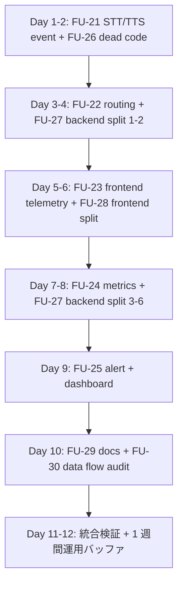

# Wave 3 Handoff: Observability & Refactor Foundation (Pre Phase 2)

> **対象**: Backend / Frontend / Infra (terraform) 担当エンジニア
> **作成**: 2026-05-18, Claude Code session (terisuke 指示)
> **位置付け**: ADR-027 の実装ハンドオフ。Wave 2 (ADR-026) merge 後の運用 gap を埋める Pre Phase 2 foundation hardening
> **想定工数**: 8〜12 営業日 (Theme A + B 並列、Backend 2〜3 名 + Frontend 1〜2 名)

---

## 0. Executive Summary

terisuke 指示:
> 一つ目は、ログの整備。定期的にログを見るだけで会話が期待通りに進んでいるか、音声入出力が期待通りのスピードが出ているか、正しいエージェントにルーティングしているかをわかるようにしてほしい。一定の域を超えたエージェントの動きの問題などがあれば、クラウドログのアラートを使って company@cor-jp.com という管理者のアドレスに送るようにしてほしい。
> 二つ目に、フロントエンドとバックエンド、全体的なリファクタリング。これだけ大規模な改修を行ったので、おそらくドキュメントはもちろんのこと、コード自体にも無駄な部分があったりするはずなので、そこを詳細に調査した上で、フェーズ2に入る前に、コードとドキュメントの全体整理をしておきたい。

→ **Theme A (Observability + Alert)** + **Theme B (Refactor + Docs)** の 2 テーマで Wave 3 を構成。

---

## 1. 現状調査結果 (2026-05-18 実測)

### 1.1 Observability (Theme A 必要性)

| 項目 | 実測 | 評価 |
|------|------|------|
| Cloud Monitoring alert policies | **0** | ❌ 完全未整備 |
| Notification channels | **0** | ❌ company@cor-jp.com 未登録 |
| Log-based metrics | **0** | ❌ percentile / count なし |
| Backend structured_logger.py | ✅ 既存 | △ 一部 event は call site 不在 |
| memory_* events | ✅ 44 件/日 発火 | OK |
| chat_response event | ✅ 22 件/日 発火 | OK (ただし field 不足) |
| stt_qwen_complete event | ❌ 0 件/日 | NG (定義あるが呼ばれていない) |
| tts_* events | ❌ 0 件/日 | NG |
| agent_routing event | ❌ 未定義 | NG |
| Frontend audio telemetry | console.debug only | NG (Backend に来ない) |

### 1.2 Refactor (Theme B 必要性)

**Backend ≥800 行 ファイル: 17 個**

| ファイル | 行数 | 優先度 |
|---------|------|--------|
| `backend/agents/stt_agent.py` | 3,033 | P0 (最大) |
| `backend/workflows/main_workflow.py` | 2,588 | P0 |
| `backend/agents/facility_agent.py` | 2,071 | P0 |
| `backend/main.py` | 1,984 | P0 |
| `backend/tools/enhanced_rag.py` | 1,731 | P1 |
| `backend/evaluation/run_live_api_eval.py` | 1,729 | P2 (eval 系後回し) |
| `backend/agents/business_info_agent.py` | 1,635 | P1 |
| `backend/agents/voice_agent.py` | 1,610 | P1 |
| `backend/scripts/seed_knowledge.py` | 1,360 | P2 |
| `backend/evaluation/live_quality_gates.py` | 1,308 | P2 |
| `backend/agents/character_control_agent.py` | 1,292 | P2 |
| `backend/config/routing_constants.py` | 1,256 | P2 |
| `backend/agents/general_knowledge_agent.py` | 1,222 | P2 |
| `backend/utils/memory_helper.py` | 1,084 | P2 |
| `backend/api/knowledge.py` | 1,041 | P2 |
| `backend/utils/intent_classifier.py` | 899 | P3 |
| `backend/agents/event_agent.py` | 891 | P3 |

**Frontend ≥800 行 ファイル: 6 個**

| ファイル | 行数 | 優先度 |
|---------|------|--------|
| `frontend/src/app/components/VoiceInterface.tsx` | 1,959 | P0 |
| `frontend/src/app/components/CharacterAvatar.tsx` | 1,555 | P0 |
| `frontend/src/app/components/ReceptionPdfGuide.tsx` | 1,304 | P1 |
| `frontend/src/lib/vrm-utils.ts` | 962 | P1 |
| `frontend/src/app/page.tsx` | 840 | P2 |
| `frontend/src/lib/voice-recorder.ts` | 824 | P2 |

**docs**:
- `docs/plans/` に **21 ファイル**累積、status / archive 規則なし
- `docs/STT-Implementation-Trace.md`: 2026-04-12 最終 (Wave 2 反映なし)
- `docs/CODEMAPS/`: **存在しない**

**Dead code**:
- TODO / FIXME / HACK は backend 0 件 (= プラスの兆候)
- knip / ts-prune / vulture 未実行 — Wave 3 で初実行

---

## 2. Theme A: Observability & Alerting (FU-21〜25)

### FU-21 [P0] Backend STT/TTS 構造化ログ call site 完成
- **対象**: `backend/agents/stt_agent.py`, `backend/clients/qwen_stt_client.py`, `backend/clients/piper_plus_client.py`, `backend/services/tts_*.py`
- **発火 event**: `stt_qwen_complete`, `stt_qwen_hedge_start`, `stt_vosk_complete`, `stt_winner`, `tts_synthesis_start`, `tts_synthesis_complete`, `tts_cache_hit/miss`
- **payload schema** (必須 fields):
  ```json
  {
    "event": "stt_qwen_complete",
    "provider": "qwen-primary",
    "language": "ja",
    "audio_duration_ms": 2340,
    "latency_ms": 1820,
    "confidence": 0.94,
    "transcript_length": 18,
    "winner": true,
    "session_id": "...",
    "request_id": "..."
  }
  ```
- **Verification**: `pytest backend/tests/observability/test_stt_tts_events.py` 全 PASS + live で `gcloud logging read 'jsonPayload.event="stt_qwen_complete"' --limit 5` で実 record 確認
- **工数**: 1.5 日

### FU-22 [P0] agent_routing + voice_round_trip event 新設
- **対象**: `backend/agents/orchestrator_agent.py`, `backend/api/voice.py`, `backend/api/chat.py`
- **新 event**:
  - `agent_routing`: `{routed_to, intent, confidence, fallback_used, alternatives, latency_ms}`
  - `voice_round_trip`: `{stt_ms, chat_ms, tts_ms, total_ms, success, error_type}`
- **既存 chat_response 拡張**: `agent_route`, `intent`, `confidence`, `tools_used[]` を必須化
- **Verification**: live `/api/voice` 1 セッション後に 3 event 種類すべてが Cloud Logging に出ること
- **工数**: 1.5 日

### FU-23 [P0] Frontend telemetry → Backend POST
- **対象**: `frontend/src/app/hooks/useVoiceSessionController.ts`, `frontend/src/lib/audio/audio-user-interaction-gate.ts`
- **新 endpoint**: `POST /api/telemetry/voice` (Backend 新設)
  - payload: `{event, payload, session_id, browser_info, timestamp}`
  - Backend 側で structured_logger 経由で Cloud Logging に書き出し
- **送信 event**: `voice_state_transition`, `thinking_watchdog_expire`, `fallback_tts_triggered`, `user_interaction_gate_timeout`, `audio_playback_failed`
- **送信方式**: `navigator.sendBeacon()` で非同期 fire-and-forget (UX に影響しない)
- **既存 console.debug は残す** (開発用)
- **Verification**: kiosk で連続 3 発話 → 全 transition event が backend log に出る
- **工数**: 2 日

### FU-24 [P0] Cloud Logging log-based metrics
- **対象**: `terraform/cloud-monitoring/metrics.tf` 新設 (または gcloud script)
- **作成する metric (9 個)**:

| Metric 名 | type | filter |
|----------|------|--------|
| `voice_round_trip_latency_ms` | distribution | `jsonPayload.event="voice_round_trip" → total_ms` |
| `chat_response_latency_ms` | distribution | `jsonPayload.event="chat_response" → latency_ms` |
| `stt_latency_ms` | distribution | `jsonPayload.event="stt_qwen_complete" → latency_ms` |
| `tts_latency_ms` | distribution | `jsonPayload.event="tts_synthesis_complete" → latency_ms` |
| `agent_route_distribution` | counter | `jsonPayload.event="agent_routing" group_by routed_to` |
| `stt_winner_ratio` | counter | `jsonPayload.event="stt_winner" group_by provider` |
| `error_rate_5m` | counter | `severity>=ERROR` |
| `frontend_audio_watchdog_rate` | counter | `jsonPayload.event="thinking_watchdog_expire"` |
| `frontend_fallback_rate` | counter | `jsonPayload.event="fallback_tts_triggered"` |

- **Verification**: `gcloud logging metrics list` で 9 metric 全表示 + Cloud Monitoring UI で data 流入確認
- **工数**: 1 日

### FU-25 [P0] Notification channel + Alert policies
- **対象**: `terraform/cloud-monitoring/alerts.tf` 新設
- **Notification channel**: Email = `company@cor-jp.com`
- **Alert policies** (7 件、初期は warn しきい値):

| Alert | Condition | Severity |
|-------|-----------|---------|
| voice-round-trip-p95-slow | voice_round_trip_latency_ms p95 > 8s for 10min | P2 |
| chat-response-p95-slow | chat_response_latency_ms p95 > 6s for 10min | P2 |
| stt-latency-degradation | stt_latency_ms p95 > 5s for 15min | P2 |
| backend-error-burst | error_rate_5m > 20/5min for 10min | P1 |
| agent-routing-skew | `fallback_general` ratio > 30% for 30min | P3 |
| frontend-audio-watchdog-spike | frontend_audio_watchdog_rate > 10/15min | P2 |
| cloud-run-traffic-zero | request count = 0 for 30min (12-20 JST) | P3 |

- **Alert email**: subject prefix `[Engineer Cafe Navigator]`, 本文に Cloud Logging URL
- **Dashboard**: `Engineer Cafe Navigator — Production` 新設、上記 metric を panel 化
- **Verification**: test alert を意図的に fire させて company@cor-jp.com に届くこと
- **工数**: 1.5 日

### Theme A 合計工数: **約 7.5 日** (Backend 2 名並列で 4 日)

---

## 3. Theme B: Refactoring & Documentation (FU-26〜30)

### FU-26 [P0] Dead code 削除
- **対象**: 全 frontend + 全 backend
- **手順**:
  1. Frontend: `cd frontend && npx knip --reporter json > /tmp/knip.json` + `npx ts-prune > /tmp/ts-prune.txt`
  2. Backend: `cd backend && ruff check --select F401,F811 .` + `vulture backend/ --min-confidence=80 > /tmp/vulture.txt`
  3. 検出された unused export / import / function を **テストが落ちないことを確認しながら** 削除
  4. 削除前後でカバレッジ ≥80% 維持
- **Verification**: `pnpm lint && pnpm typecheck && pnpm build`, `ruff check . && black --check . && pytest -m "not slow and not ragas"` 全 PASS
- **工数**: 1.5 日

### FU-27 [P0] Backend 大ファイル分割 (top 6)
- **対象** (順番):
  1. `backend/main.py` (1,984) → `backend/api/__init__.py` + `backend/api/voice.py` + `backend/api/chat.py` + `backend/api/calendar.py` + `backend/api/admin.py`
  2. `backend/agents/stt_agent.py` (3,033) → `stt_agent.py` (公開 IF) + `stt/qwen_handler.py` + `stt/vosk_handler.py` + `stt/hedge.py` + `stt/postprocess.py`
  3. `backend/workflows/main_workflow.py` (2,588) → subgraph 別 + helper module 分離
  4. `backend/agents/facility_agent.py` (2,071) → category 別
  5. `backend/agents/business_info_agent.py` (1,635) → category 別
  6. `backend/tools/enhanced_rag.py` (1,731) → pipeline stage 別
- **完了条件**: 分割後の各 file < 800 行、既存 unit/integration test 全 PASS、live behavior 1:1 一致 (live smoke)
- **PR 分割**: 各 file 分割を 1 PR (= 6 PR)
- **工数**: 3 日 (Backend engineer 2 名並列で 1.5 日)

### FU-28 [P0] Frontend 大ファイル分割 (top 3)
- **対象**:
  1. `VoiceInterface.tsx` (1,959) → `VoiceInterface.tsx` (container) + `hooks/useVoicePlayback.ts` + `hooks/useFallbackTTS.ts` + `components/PlaybackController.tsx` + `components/FallbackUI.tsx`
  2. `CharacterAvatar.tsx` (1,555) → `CharacterAvatar.tsx` (container) + `hooks/useVRMLifecycle.ts` + `hooks/useExpression.ts` + `hooks/useLipsync.ts`
  3. `ReceptionPdfGuide.tsx` (1,304) → component 分離
- **完了条件**: 分割後の各 file < 800 行、Playwright e2e PASS (theme-b-audio-reliability.spec.ts 含む)
- **PR 分割**: 各 file 分割を 1 PR (= 3 PR)
- **工数**: 2.5 日 (Frontend engineer 1 名で)

### FU-29 [P1] docs 整理 + CODEMAPS 整備
- **手順**:
  1. `docs/plans/archive/` 新設、completed plan を移動 (各 plan 冒頭に `> Status: completed YYYY-MM-DD` 追記)
  2. 移動対象 (推奨, 16 件): production-hardening-2026-03-14, deployment-readiness-2026-03-15, production-integration-2026-03-16, qwen-cloud-run-validation-2026-04-11, alpha-trial-p1-remediation-2026-04-13, production-readiness-followup-2026-04-19, alpha-fast-response-2026-04-30, alpha-parallel-blocker-2026-04-30, alpha-remediation-2026-05-02, alpha-reset-2026-05-03, comprehensive-refactoring-2026-05-05, post-alpha-voice-rag-frontend-2026-05-09, voice-speed-issue-closure-2026-05-16, reception-quality-issues-2026-05-16, frontend-api-separation-closure-2026-05-16, alpha-ui-e2e-hardening-2026-04-12
  3. アクティブ残す (推奨, 5 件): wave2-date-audio-calendar-handoff, event-source-spreadsheet-integration, event-spreadsheet-engineer-handoff, post-adr023-investigation, semantic-router-self-eval, **+ 本 wave3-observability-refactor-handoff**
  4. `docs/STT-Implementation-Trace.md` を Wave 2 後の状態に最新化 (TZ=Asia/Tokyo + date-only fast path 追記)
  5. `docs/observability-runbook.md` に Wave 3 で追加した metric / alert を追記
  6. `docs/CODEMAPS/` 新設、`/update-codemaps` skill で `backend.md`, `frontend.md`, `architecture.md` を自動生成
- **完了条件**: docs/plans/archive 移動完了、ルート 4 docs 最新化、CODEMAPS 3 file 生成
- **工数**: 1 日

### FU-30 [P1] 4-point data flow audit
- **対象 endpoint** (Wave 2 で変更されたもの):
  - `/api/voice/*` (STT + TTS)
  - `/api/chat` (LangGraph 全 agent)
  - `/api/calendar` (Google Calendar ICS)
  - `/api/reception/*` (Wave 7 subgraph)
  - GAS Web App → `EVENT_SHEET_GAS_URL` → `SheetsEventSource` → KB (新 flow)
- **手順**: 各 endpoint について `docs/data-flow/<endpoint>.md` を作成、`Client → API route → Backend → Response` の 4 点を file:line 引用付きで記録
- **完了条件**: 5 endpoint 全て markdown 作成、CLAUDE.md ルール satisfied
- **工数**: 1 日

### Theme B 合計工数: **約 9 日** (Backend 2 名 + Frontend 1 名並列で 5 日)

---

## 4. 全体スケジュール案 (8〜12 営業日)



### 推奨 PR 分割

| PR | Branch | Scope | 担当 |
|----|--------|-------|------|
| PR-W3A-1 | `feat/wave3-stt-tts-events` | FU-21 (STT/TTS structured log call site) | Backend |
| PR-W3A-2 | `feat/wave3-routing-roundtrip-events` | FU-22 (agent_routing + voice_round_trip) | Backend |
| PR-W3A-3 | `feat/wave3-frontend-telemetry` | FU-23 (frontend → backend telemetry) | Frontend + Backend |
| PR-W3A-4 | `feat/wave3-cloud-metrics-alerts` | FU-24 + FU-25 (terraform) | Infra |
| PR-W3B-1 | `refactor/wave3-dead-code-removal` | FU-26 | Backend + Frontend |
| PR-W3B-2a..f | `refactor/wave3-backend-split-<file>` | FU-27 (各 file ごと 1 PR) | Backend |
| PR-W3B-3a..c | `refactor/wave3-frontend-split-<file>` | FU-28 (各 file ごと 1 PR) | Frontend |
| PR-W3B-4 | `docs/wave3-archive-and-codemaps` | FU-29 | 誰でも |
| PR-W3B-5 | `docs/wave3-data-flow-audit` | FU-30 | Backend |

合計 PR 数: **約 13 PR**。並列マージ可能 (各 PR は独立)。

---

## 5. GitHub Issue 構成案

### Epic
- **`[Epic][Wave 3] Pre Phase 2 Foundation Hardening (Observability + Refactor)`**
  - Labels: `epic`, `wave-3`, `P0`, `pre-phase-2`

### Theme Sub-Epics (2)
- **`[Theme A][Wave 3] Observability & Alerting (FU-21〜25)`**
  - Labels: `wave-3`, `theme-a`, `P0`, `backend`, `infrastructure`
- **`[Theme B][Wave 3] Refactoring & Documentation (FU-26〜30)`**
  - Labels: `wave-3`, `theme-b`, `P0`, `backend`, `frontend`, `documentation`

### Sub-Issues (10)
- FU-21 〜 FU-30 (本 doc §2 + §3 参照)

---

## 6. 完了条件 (全 Wave 3 GO)

- [ ] Cloud Monitoring: 9 metric + 7 alert policy + 1 notification channel (`company@cor-jp.com`) deployed
- [ ] Backend log: `agent_routing` / `voice_round_trip` / `stt_*` / `tts_*` event が live で発火
- [ ] Frontend telemetry: `thinking_watchdog_expire` 等の 5 event が Cloud Logging に出る
- [ ] Backend ファイル: 全 ≥800 行 file が < 800 行 に分割
- [ ] Frontend ファイル: 全 ≥800 行 file が < 800 行 に分割
- [ ] Dead code: knip / ts-prune / vulture 結果ゼロ
- [ ] docs/plans/archive: 16 件移動完了、status 明記
- [ ] docs/STT-Implementation-Trace.md / observability-runbook.md 最新化
- [ ] docs/CODEMAPS/ 3 file 生成
- [ ] docs/data-flow/ 5 endpoint 監査完了
- [ ] CI: lint / typecheck / build / test 全 PASS
- [ ] live smoke: Wave 2 と同じ 6 query で regression なし
- [ ] alert dry-run: company@cor-jp.com に test mail 到達確認

---

## 7. Open Questions / Risks

| # | Question / Risk | Owner | 期限 |
|---|----------------|-------|------|
| Q1 | terraform/cloud-monitoring を新規導入するか、gcloud script で済ますか | Infra | Day 0 |
| Q2 | Backend api 分割で main.py の app instance を誰が hold するか (FastAPI mount pattern) | Backend | Day 1 |
| Q3 | Frontend telemetry の `navigator.sendBeacon` failover (Safari iOS 旧 version) | Frontend | Day 5 |
| Q4 | Alert しきい値 (p95 8s 等) が初期過敏ではないか | Backend / 運用 | Day 9 |
| R1 | 大ファイル分割で import path 大量変更 → CI 緑化に時間 | Backend | 各 PR で個別対応 |
| R2 | Cloud Monitoring 月額コスト増 (metric ingestion + alert eval) | Infra | Day 0 概算 |
| R3 | 既存 plan を archive する際、現在進行中のものを誤って archive する | doc owner | §3 FU-29 リスト参照 |
| R4 | terraform 導入で手動 plan/apply ルール (observability-runbook.md) との二重管理 | Infra | Day 0 |
| R5 | Frontend 分割で VRM lifecycle (CharacterAvatar) を壊す | Frontend | Playwright e2e 必須 |

---

## 8. Reference

- ADR-027 (本 Wave の根拠): `docs/adr/027-wave3-observability-and-refactor-foundation.md`
- ADR-026 (Wave 2): `docs/adr/026-wave2-kiosk-ux-reliability-baseline.md`
- 既存 observability runbook: `docs/observability-runbook.md`
- 既存 structured logger: `backend/observability/structured_logger.py`
- Cloud Run service: `engineer-cafe-backend` @ `asia-northeast1` (project `aipartner-426616`)
- Notification target: `company@cor-jp.com`
