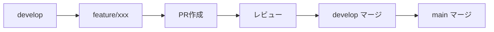
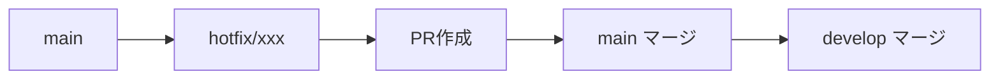

# ブランチ戦略

## 概要

Engineer Cafe NavigatorはGitHub Flowベースのブランチ戦略を採用しています。

## ブランチ構成

```
main                    # 本番環境（保護ブランチ）
├── develop             # 開発統合ブランチ
│   ├── feature/*       # 機能開発
│   ├── fix/*           # バグ修正
│   ├── docs/*          # ドキュメント更新
│   └── chore/*         # 保守作業
└── hotfix/*            # 緊急修正（mainから直接分岐）
```

## ブランチ命名規則

### プレフィックス

| プレフィックス | 用途 | 例 |
|--------------|------|-----|
| `feature/` | 新機能開発 | `feature/router-agent-implementation` |
| `fix/` | バグ修正 | `fix/memory-session-id` |
| `docs/` | ドキュメント更新 | `docs/ocr-agent-yolo-update` |
| `chore/` | 保守作業 | `chore/repo-cleanup` |
| `hotfix/` | 緊急修正 | `hotfix/api-timeout` |
| `refactor/` | リファクタリング | `refactor/agent-architecture` |
| `test/` | テスト追加 | `test/router-agent-unit` |

### 命名ルール

1. **小文字のみ**使用
2. **ハイフン区切り**（スネークケースではなく）
3. **簡潔かつ説明的**な名前
4. **Issue番号**を含める場合は末尾に付ける

```
良い例:
- feature/openrouter-infrastructure
- fix/memory-leak-#42
- docs/api-reference

悪い例:
- Feature/OpenRouter_Infrastructure
- fix
- wip-stuff
```

## ワークフロー

### 通常の機能開発



1. `develop`から`feature/xxx`を作成
2. 機能を実装してコミット
3. PRを作成（developへ）
4. レビュー・承認
5. developにマージ
6. リリース時にmainへマージ

### 緊急修正



1. `main`から`hotfix/xxx`を作成
2. 修正を実装
3. PRを作成（mainへ）
4. 緊急レビュー・承認
5. mainにマージ
6. developにもバックポート

## コミットメッセージ規約

### フォーマット

```
<type>(<scope>): <subject>

<body>

<footer>
```

### Type一覧

| Type | 説明 |
|------|------|
| `feat` | 新機能 |
| `fix` | バグ修正 |
| `docs` | ドキュメント |
| `style` | フォーマット変更 |
| `refactor` | リファクタリング |
| `test` | テスト追加・修正 |
| `chore` | ビルド・補助ツール |

### 例

```
feat(router-agent): Add memory-aware routing logic

- Implement memory keyword detection for Japanese
- Add context-dependent query handling
- Support request type extraction

Closes #123
```

## プルリクエスト

### PRテンプレート

```markdown
## Summary
- 変更点1
- 変更点2

## Test plan
- [ ] 単体テスト追加
- [ ] 手動テスト実施
- [ ] CIパス確認
```

### レビュールール

1. **最低1人**のレビュー承認が必要
2. **CIがパス**していること
3. **コンフリクト解消**済みであること

## 保護ルール

### main ブランチ

- 直接プッシュ禁止
- PRでのマージのみ
- 最低1人のレビュー承認必須
- CIパス必須

### develop ブランチ

- PRでのマージ推奨
- 直接プッシュは許可（緊急時のみ）

## 関連ドキュメント

- [BRANCH-PROTECTION-SETUP.md](../../BRANCH-PROTECTION-SETUP.md)
- [CONTRIBUTING.md](../../CONTRIBUTING.md)
- [GitHub Flowについて](https://docs.github.com/en/get-started/quickstart/github-flow)
